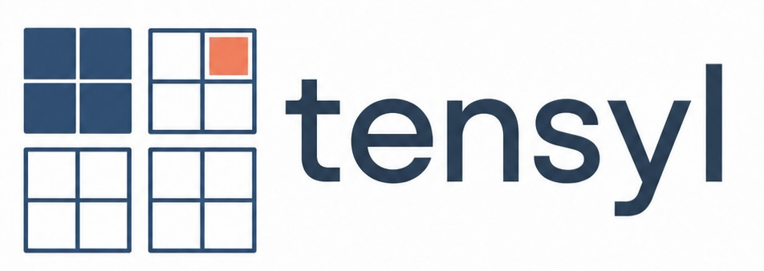

# Tensyl

Tensyl is a Python scientific-computing library for equivalent-stiffness
homogenization of stiffened plates and shells.

The library builds local ABD and transverse-shear stiffness laws for skins,
laminates, stiffened tangent-plane cells, and geometry-bound stiffness fields. It
keeps conventions, diagnostics, validity data, and serialization metadata
explicit.

The public Python package name is `tensyl`.

## Mechanics Lineage

Tensyl implements a documented equivalent-plate tradition in Python. The first
stiffened-cell homogenization family is based on Michael P. Nemeth's NASA
treatise, *A Treatise on Equivalent-Plate Stiffnesses for Stiffened
Laminated-Composite Plates and Plate-Like Lattices* (NASA/TP-2011-216882), which
collects direct equilibrium-compatibility and strain-energy formulations for
stiffened laminated plates and plate-like lattices.

The stiffness notation follows classical laminated plate and first-order
shear-deformation theory: `A`, `B`, `D`, and `As` are stored together as one
canonical `8 x 8` tangent. The documentation lists the mechanics sources in
[References](docs/references.md) and writes out the governing equations in
[Equivalent-Stiffness Mechanics](docs/theory/equivalent-stiffness.md).

## Install

```bash
uv add tensyl
```

or:

```bash
pip install tensyl
```

For local development from this repository:

```bash
uv sync --dev
```

## Library Capabilities

**Materials and skins**

- isotropic plate skins with transverse shear;
- orthotropic ply materials;
- bottom-to-top laminate stacks with ply angle, thickness, and density;
- canonical `A`, `B`, `D`, `As`, and `C8` stiffness storage.

**Stiffener sections**

- direct `BeamSection` input for `EA`, `EI`, `GJ`, and shear stiffness products;
- geometry-derived open thin-wall sections for blade, tee, zee, channel, and hat
  stiffeners;
- custom `ThinWallSegment` layouts for open thin-wall section geometry.

**Cell and pattern libraries**

- unidirectional and orthogrid cells;
- braced orthogrid cells;
- equilateral isogrid cells;
- isosceles triangle, Kagome, hexagonal, and star pattern cells;
- sandwich-core variants;
- graph-defined custom unit cells through `CellNode`, `CellEdge`, and
  `graph_unit_cell`.

**Homogenization and review data**

- `EnergyHomogenizer` as the reference homogenizer;
- `DirectECHomogenizer` for supported direct equilibrium-compatibility cases;
- `HomogenizationResult` with stiffness, diagnostics, assumptions, and validity;
- scale-separation checks for stiffener height, pitch, curvature radius, response
  length, and membrane-bending coupling.

**Geometry and fields**

- flat plates, cylinders, spheres, spherical caps, conical frustums, and
  ellipsoids;
- constant stiffness fields;
- pointwise homogenized stiffness fields with local cell factories;
- sampled stiffness atlases with bilinear interpolation in canonical `C8` storage.

**External handoff**

- YAML and JSON serialization for `ABDStiffness` and `HomogenizationResult`;
- schema versioning, unit labels, diagnostics, assumptions, and validity metadata;
- solver-neutral artifacts for downstream tools.

## Example 1: Skin-Only ABD Stiffness

An isotropic skin about its mid-surface has zero membrane-bending coupling in
the `B` block.

```python
from tensyl import IsotropicMaterial, isotropic_plate

aluminum = IsotropicMaterial(E=10.6e6, nu=0.33, density=0.1)
stiffness = isotropic_plate(aluminum, thickness=0.080)

print(stiffness.A)   # membrane stiffness
print(stiffness.B)   # membrane-bending coupling
print(stiffness.D)   # bending stiffness
print(stiffness.As)  # transverse-shear stiffness
```

The canonical tangent is an `8 x 8` matrix. The named blocks are views into that
operator:

- `A`: membrane stiffness;
- `B`: membrane-bending coupling;
- `D`: bending and twisting stiffness;
- `As`: transverse-shear stiffness.

Tensyl keeps stiffness as the first-class result. Scalar equivalent moduli are
derived interpretations, not the primary object.

## Example 2: Composite Laminate

`laminate_plate` builds a plate stiffness from ply material, ply thickness, and
ply angle. The stack is supplied bottom-to-top.

```python
import math

from tensyl import OrthotropicPlyMaterial, Ply, laminate_plate

carbon_epoxy = OrthotropicPlyMaterial(
    E1=18.0e6,
    E2=1.4e6,
    G12=0.75e6,
    nu12=0.28,
    G13=0.75e6,
    G23=0.50e6,
    density=0.058,
)

stiffness = laminate_plate(
    (
        Ply(material=carbon_epoxy, thickness=0.005, angle_rad=0.0),
        Ply(material=carbon_epoxy, thickness=0.005, angle_rad=0.5 * math.pi),
        Ply(material=carbon_epoxy, thickness=0.005, angle_rad=0.0),
    )
)

assert stiffness.C8.shape == (8, 8)
assert abs(stiffness.B).max() < 1.0e-9
```

The two zero-degree plies make the local `e1` direction stiffer than `e2`. The
symmetric stack keeps `B` near zero, so membrane strain and bending curvature are
not coupled by the chosen reference surface.

## Example 3: Geometry-Derived Orthogrid

Thin-wall section helpers compute centroidal beam-section stiffnesses from
section geometry. Those sections can be used directly in cell constructors.

```python
from tensyl import (
    EnergyHomogenizer,
    IsotropicMaterial,
    blade_section,
    hat_section,
    isotropic_plate,
    orthogrid_cell,
)

aluminum = IsotropicMaterial(E=10.6e6, nu=0.33, density=0.1)
skin_thickness = 0.080
skin = isotropic_plate(aluminum, thickness=skin_thickness)

stringer = hat_section(
    material=aluminum,
    web_height=0.50,
    web_thickness=0.050,
    crown_width=0.40,
    crown_thickness=0.050,
    flange_width=0.20,
    flange_thickness=0.050,
)

rib = blade_section(
    material=aluminum,
    height=0.50,
    thickness=0.050,
    shear_correction_y=5.0 / 6.0,
    shear_correction_z=5.0 / 6.0,
)

skin_face_offset = 0.5 * skin_thickness
cell = orthogrid_cell(
    skin=skin,
    stringer_section=stringer.section,
    rib_section=rib.section,
    stringer_spacing=6.0,
    rib_spacing=8.0,
    stringer_eccentricity=skin_face_offset + stringer.centroid_z,
    rib_eccentricity=skin_face_offset + rib.centroid_z,
)

result = EnergyHomogenizer().compute(cell)

print(result.stiffness.A)
print(result.stiffness.B)
print(result.diagnostics)
print(result.validity.warnings)
```

The result contains the homogenized stiffness, diagnostics, modeling assumptions,
and validity warnings. Nonzero `B` follows from eccentric stiffeners relative to
the chosen reference surface.

## Example 4: Custom Graph Cell

`graph_unit_cell` defines a tangent-plane cell from local nodes, edges, section
properties, eccentricities, and cell area.

```python
from tensyl import (
    BeamSection,
    CellEdge,
    CellNode,
    EnergyHomogenizer,
    graph_unit_cell,
)

section = BeamSection(
    EA=3.2e6,
    EIy=2.4e4,
    EIz=6.5e3,
    GJ=4.0e3,
    kGAy=1.1e6,
    kGAz=0.9e6,
)

custom = graph_unit_cell(
    area=48.0,
    skin=skin,
    nodes=(
        CellNode(0.0, 0.0),
        CellNode(6.0, 0.0),
        CellNode(0.0, 8.0),
    ),
    edges=(
        CellEdge(0, 1, section, eccentricity=0.45),
        CellEdge(0, 2, section, eccentricity=0.45),
    ),
)

custom_result = EnergyHomogenizer().compute(custom)
```

The graph constructor converts the node and edge layout into canonical beam
members before homogenization.

## Example 5: Stiffness on a Shell Surface

Geometry is separate from constitutive stiffness. A cylinder supplies local
frames and curvature context; it does not alter the numeric ABD matrix in a
constant stiffness field.

```python
from tensyl import ConstantStiffnessField, Cylinder

surface = Cylinder(radius=120.0, length=300.0)
field = ConstantStiffnessField(result.stiffness)

stiffness_at_midbay = field.stiffness_at(surface, 150.0, 0.0)

assert stiffness_at_midbay.frame.label == "cylinder"
assert stiffness_at_midbay.C8.shape == (8, 8)
```

Variable structure can be represented with `HomogenizedStiffnessField`, which
rebuilds the local cell at each surface point, or with `ABDAtlas`, which
interpolates sampled stiffnesses.

## Example 6: Export

`tensyl.io` serializes stiffnesses and homogenization results to solver-neutral
YAML or JSON artifacts.

```python
from pathlib import Path

from tensyl.io import read_yaml, to_yaml, write_yaml

text = to_yaml(
    result,
    units={"length": "in", "force": "lbf", "stress": "psi"},
)

write_yaml(
    result,
    Path("stiffness.yaml"),
    units={"length": "in", "force": "lbf", "stress": "psi"},
)

same_result = read_yaml(Path("stiffness.yaml"))
```

Unit labels ride along with the export as metadata; Tensyl never inspects or
converts the values. Whatever consistent system you put in is the system you get
back.

## Scope

Tensyl forms and audits equivalent ABD stiffnesses. It is not a certification
buckling solver, a local stress recovery tool, or a substitute for detailed
finite-element analysis, and its tangent-plane homogenization relies on scale
separation between stiffener pitch, stiffener height, local curvature radius, and
the structural response length of interest.

Local buckling, crippling, joints, cutouts, load introduction, nonlinear
postbuckling, and final allowables stay outside the current package scope.

## Documentation Map

The formal documentation is built with MkDocs from `docs/`.

- [Getting started](docs/getting-started/installation.md) covers setup and the
  shortest path to an ABD stiffness.
- [Background](docs/background/motivation.md) explains the engineering motivation
  and terminology.
- [Theory](docs/theory/equivalent-stiffness.md) documents ABD stiffnesses,
  conventions, tangent-plane homogenization, and validity limits.
- [User guide](docs/user-guide/materials-and-laminates.md) covers materials,
  cells, sections, geometry, fields, and external handoff.
- [Examples](docs/examples/skin-only.md) provides worked examples and executable
  snippets.
- [API reference](docs/api/core.md) exposes the public Python interfaces.
- [References](docs/references.md) lists the external sources used by the
  mechanics documentation.

## Development

This repository uses `uv` for dependency management and command execution.

```bash
uv sync --dev
uv run ruff check .
uv run ruff format --check .
uv run ty check
uv run pytest
uv run mkdocs build --strict
```

Release notes are tracked in [CHANGELOG.md](CHANGELOG.md), and contribution
process details are in [CONTRIBUTING.md](CONTRIBUTING.md).

## Documentation Authoring

Documentation math uses `$...$` for inline equations and `$$...$$` for display
equations so the same Markdown renders in Obsidian and MkDocs.
