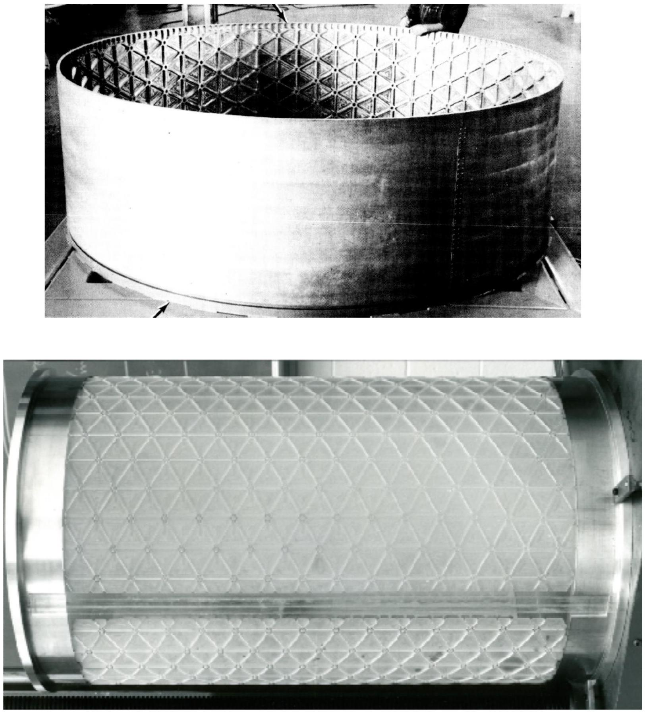

# Motivation and History

Stiffened plates and shells appear throughout aerospace engineering:
integrally stiffened panels, launch-vehicle barrels, ring-and-stringer shells,
isogrids, orthogrids, sandwich sections, and lattice-like facesheets.

Detailed stiffener-by-stiffener models are the gold standard — and a slog.
Rebuilding every rib for a trade study you will throw away next week is a poor
use of a Tuesday. Equivalent-stiffness modeling smears the stiffeners into a single
continuum ABD stiffness: you trade local detail for a small, auditable matrix that
still gets the global membrane, bending, twisting, and shear story right.

Tensyl's core rule is:

> Compute a local equivalent-stiffness model; embed that stiffness in
> geometry-specific shell kinematics.

This separation keeps the local homogenization problem small and auditable. A
local ABD stiffness can be computed on a tangent plane, checked for validity, rotated, and
then attached to a flat panel, cylindrical barrel, dome, or other surface.

*Source: Nemeth, NASA/TP-2011-216882, figure 3; full citation in
[References](../references.md).*

## Use Cases

Tensyl is intended for:

- early sizing of stiffened skins and shell sections;
- trade studies over stiffener pitch, height, orientation, and material;
- comparison of canonical grids such as unidirectional, orthogrid, isogrid,
  hexagonal, star, and sandwich-core cells;
- building solver-neutral stiffness artifacts for external workflows;
- creating reduced models for global stiffness studies.

Tensyl is not intended to hide the assumptions behind equivalent-stiffness modeling.
Every homogenized result carries diagnostics and validity information because a
local ABD stiffness is useful only when its assumptions match the structural question.

New to the vocabulary — "ABD stiffness," "tangent plane," "scale separation,"
"pitch"? The [Terminology](terminology.md) page defines each precisely and is
worth a read before the Theory section.

## Brief History

Equivalent-continuum modeling is older than the finite-element method, for the
plain reason that engineers needed answers before they had the compute to model
every stiffener. The idea has aged well. Tensyl is a modern implementation of a
long tradition rather than a new invention.

Classical plate and shell theory supplied the language: membrane resultants,
bending resultants, transverse shear, and stiffness matrices. Reissner- and
Mindlin-type first-order shear-deformation theories promoted transverse shear
from an afterthought to an explicit part of the stiffness model. Laminated-plate
theory then organized anisotropic skins into the familiar `A`, `B`, and `D`
stiffness blocks that Tensyl still uses.

Nemeth's NASA treatise is the primary source for Tensyl's first homogenization
family. It surveys decades of equivalent-plate results and lays out both the
direct equilibrium-compatibility and strain-energy methods for stiffened
laminated plates and plate-like lattices. Tensyl implements that tradition as a
scientific Python library with explicit conventions, typed value objects,
verification checks, and neutral export formats, so the assumptions stay visible
instead of buried in a spreadsheet.

NASA SP-8007 and related shell-buckling literature are the reason these stiffness
properties matter in practice, especially for thin cylindrical shells. Tensyl
does not implement those buckling criteria; it computes and audits the ABD
stiffnesses that can feed them. See [References](../references.md) for the full
lineage.
