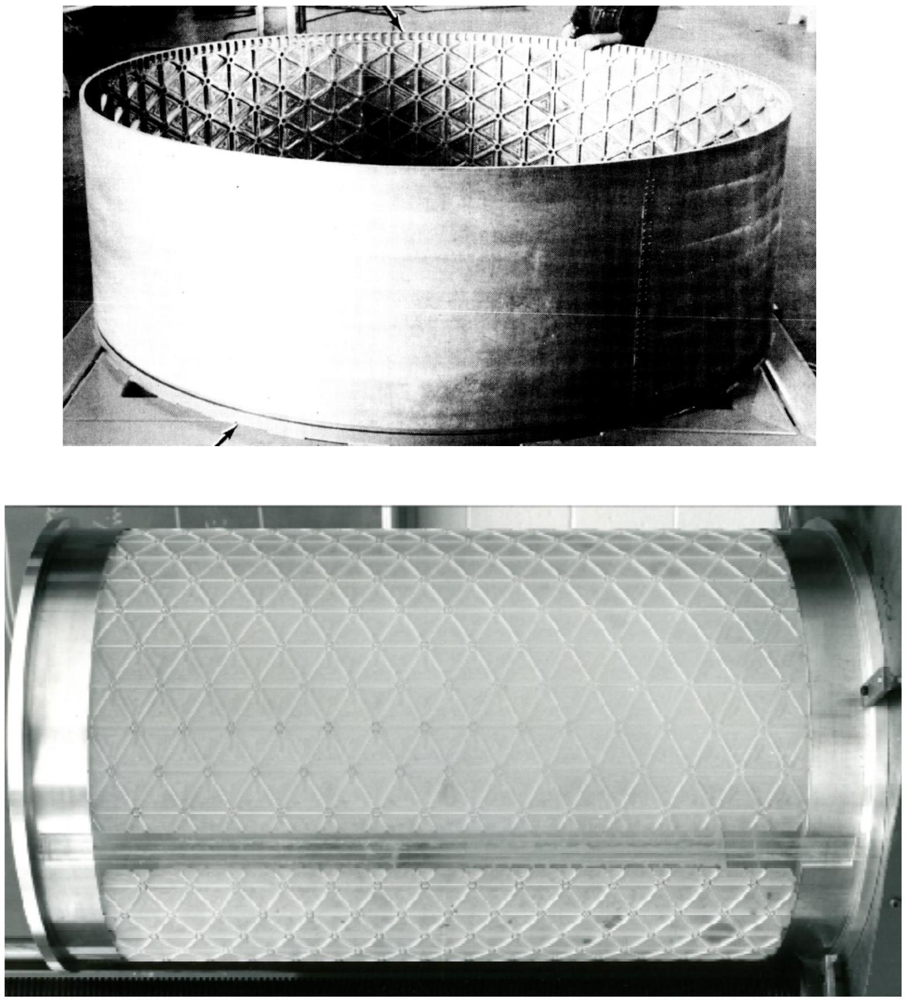

# Motivation and History

A stiffened panel contains two useful length scales: the rib repeat and the
complete structure. Equivalent-plate modeling connects them by turning the skin
and rib stiffnesses into a constitutive relation per panel area. That makes it
practical to change a construction and compare its effect on a larger plate or
shell model.

Source: [Nemeth, NASA/TP-2011-216882](https://ntrs.nasa.gov/citations/20110004039), figure 3.

## Use Cases

Tensyl supports early panel sizing, comparisons of rib pitch and section,
laminated skins, and stiffness distributions over shells. A calculation can
produce a local load–strain relation, a stiffness-and-mass sweep, or a portable
section artifact for a finite-element model.

The [walkthrough](../getting-started/first-abd-stiffness.md) follows that process
for one aluminum panel. The [modeling guide](../theory/validity.md) describes the
local cell deformation and response scales.

## Brief History

Equivalent-plate methods have a long history in stiffened plates and shells.
Nemeth's 2011 treatise surveys work dating to 1914 and develops both equilibrium–
compatibility and strain-energy formulations for stiffened laminates and lattices.
Tensyl uses the strain-energy construction for its member assembly.

Classical laminate theory supplies the `A`, `B`, and `D` blocks. Reissner–Mindlin
plate theory adds transverse shear, retained as `As`. Surface geometry then
provides the local axes and curvature for a shell application.

NASA SP-8007 is one application of these stiffness properties in cylindrical
shell analysis. The [reconciliation](../validation/sp8007-reconciliation.md)
connects Tensyl's matrix entries to its barred elastic constants. Full mechanics
sources are listed in [References](../references.md).
