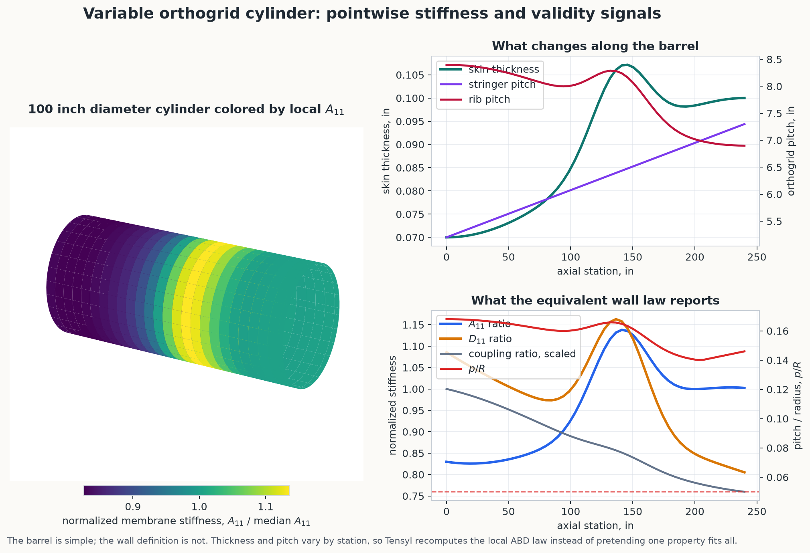
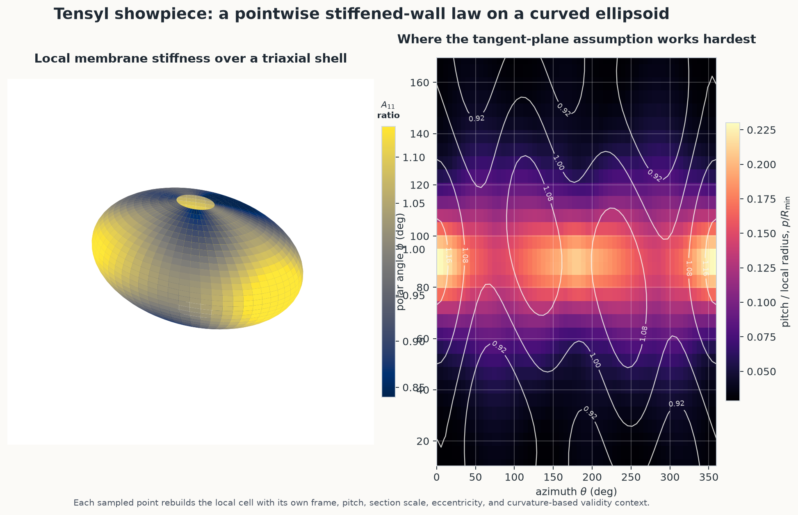

# Stiffness Field Maps

These examples show why Tensyl treats equivalent stiffness as a local wall law
that can be evaluated over a surface, not as one heroic closed-form answer. The
first case is practical: a cylindrical barrel with skin thickness and orthogrid
spacing that vary along the axis. The second case is less polite: a triaxial
ellipsoid with pointwise pitch, orientation, and section changes.

The mechanics loop is the same in both:

1. ask the surface for a point, frame, and curvature scale;
2. build a tangent-plane stiffened cell in that local frame;
3. homogenize the cell into an ABD stiffness;
4. attach validity ratios to the result;
5. repeat wherever the wall definition changes.

!!! warning "These are stiffness-field examples, not sizing sign-offs"
    Tensyl computes local equivalent stiffnesses and validity signals here. It
    does not compute buckling loads, joint stresses, imperfections, margins, or
    allowables. The pictures are useful because the assumptions are visible, not
    because the colors are persuasive. Colors are charming liars if left
    unsupervised.

## Variable Orthogrid Cylinder

Start with a friendlier surface: a 100 inch diameter cylinder with 1 inch tall
orthogrid stiffeners. The skin thickness, stringer spacing, and rib spacing vary
smoothly by axial station. That is a common enough pattern in early sizing: a
barrel gets heavier where load path, cutout, or local stiffness needs ask for
help, while the rest of the shell would prefer not to carry souvenir mass.

The figure colors the cylinder by normalized axial membrane stiffness,
`A11 / median(A11)`. The right-side plots show what changed in the input and
what Tensyl reported back: normalized `A11`, normalized `D11`, membrane-bending
coupling, and the `p_over_R` validity signal.



The most useful quantities to plot here are:

- **Design inputs:** skin thickness and both orthogrid pitches, because they are
  the knobs the example turns.
- **Membrane response:** `A11 / median(A11)`, because stringer spacing and skin
  thickness directly affect axial load carrying.
- **Bending response:** `D11 / median(D11)`, because eccentric 1 inch stiffeners
  change bending stiffness faster than the skin alone would suggest.
- **Coupling and validity:** the `B` coupling ratio and `p_over_R`, because they
  say when a reduced interpretation or tangent-plane assumption is starting to
  earn scrutiny.

The key point is not that the cylinder is exotic. It is not. The useful bit is
that the wall law changes by station while the cylinder supplies the local frame
and curvature scale. Tensyl recomputes the local equivalent stiffness wherever
the design changes, then lets you plot the consequences instead of guessing
where the property table got interesting.

## Ellipsoid Showpiece

Now make the surface less cooperative. A triaxial ellipsoid is not the first
shape anyone reaches for when they want a tidy closed-form stiffened shell
calculation. That is the point.

The local skin thickness, stiffener pitch, stiffener orientation, and section
scale vary with position. The left panel colors the ellipsoid by normalized
local `A11` membrane stiffness. The right panel shows `p_over_R`, the
pitch-to-local-radius ratio that says where the tangent-plane approximation is
working hardest. The white contours are normalized `A11` again, because a
contour line is sometimes the polite way to tell a heatmap it has company.



At each ellipsoid sample point:

- `surface.point_at(phi, theta)` supplies position, local frame, curvature, and
  `min_radius`;
- the cell factory computes local pitch, section scale, stiffener angle, skin
  thickness, and eccentricity;
- `EnergyHomogenizer` returns a local `ABDStiffness`;
- `ValidityContext` records `p_over_R`, `h_over_R`, and response-length checks.

That is the useful trick. The curved surface does not magically bend the ABD
matrix. The pointwise cell factory changes the wall law, while the surface tells
Tensyl how to read that law locally.

## Rebuild the Figures

The full generator lives at
[`docs/examples/scripts/stiffness_field_maps.py`](scripts/stiffness_field_maps.py).
It writes both committed documentation images:

```bash
uv run python docs/examples/scripts/stiffness_field_maps.py
```

The cylinder field setup follows this shape:

```python
from tensyl import (
    Cylinder,
    EnergyHomogenizer,
    HomogenizedStiffnessField,
    StiffnessCache,
    ValidityContext,
    orthogrid_cell,
)

surface = Cylinder(radius=50.0, length=240.0)


def cell_factory(surface, point):
    del surface
    design = cylinder_design_at(point.u)
    skin = isotropic_plate(material, thickness=design["skin_thickness"], frame=point.frame)
    skin_face = 0.5 * design["skin_thickness"]
    return orthogrid_cell(
        skin=skin,
        stringer_section=stringer_section(design),
        rib_section=rib_section(design),
        stringer_spacing=design["stringer_spacing"],
        rib_spacing=design["rib_spacing"],
        stringer_eccentricity=skin_face + stringer_centroid_z,
        rib_eccentricity=skin_face + rib_centroid_z,
        frame=point.frame,
    )


def validity_context(point, cell):
    pitch = max(cell.metadata["stringer_spacing"], cell.metadata["rib_spacing"])
    return ValidityContext(
        characteristic_height=1.0,
        pitch=pitch,
        min_radius=point.min_radius,
        response_length=60.0,
    )


field = HomogenizedStiffnessField(
    surface,
    cell_factory,
    EnergyHomogenizer(),
    cache=StiffnessCache(),
    validity_context_factory=validity_context,
)
```

The script includes the complete material values, geometry-derived 1 inch
sections, pointwise design rules, Matplotlib styling, and image export.

## Why This Is Useful

Closed-form equivalent-plate formulas are valuable, but they usually want a
friendly geometry, repeated layout, and fixed assumptions. The cylinder begins
with a friendly geometry but changes the wall by station. The ellipsoid changes
the surface frame, curvature, pitch, angle, and section scale. In both cases,
Tensyl still computes a consistent local wall law at each point.

That does not make the result automatically valid. It does make the assumptions
visible enough to argue with, which is a more useful starting point than a
beautiful spreadsheet with no place to put curvature.
