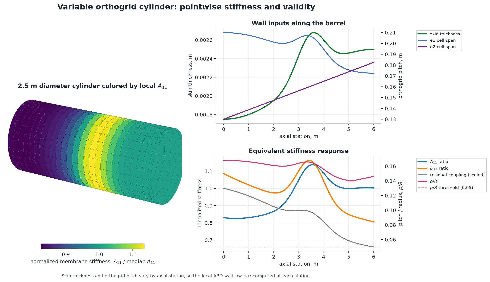
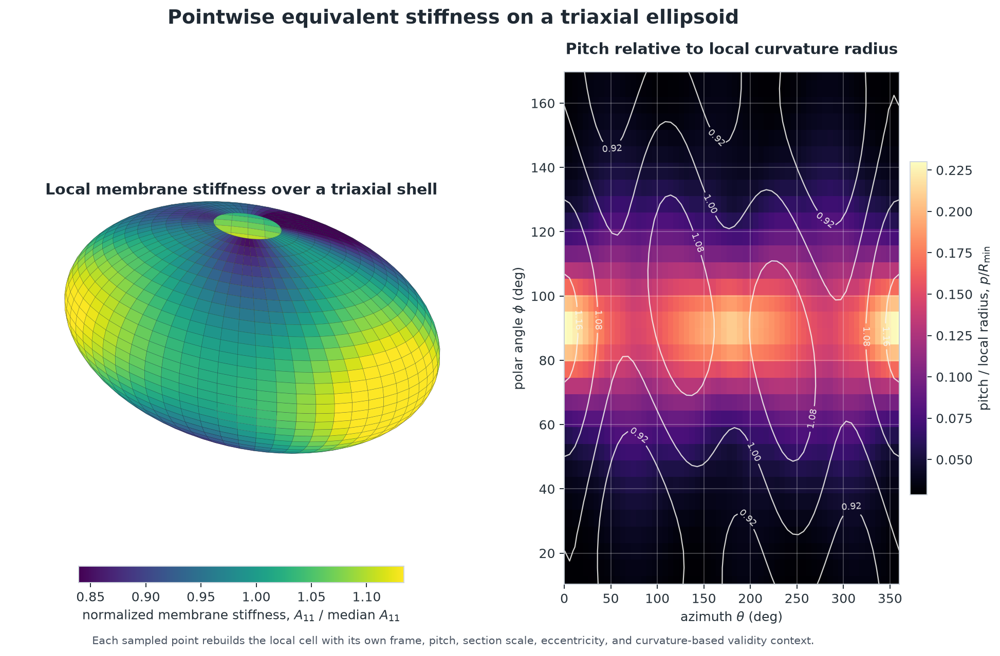

# Stiffness Field Maps

Plot the design inputs alongside the calculated stiffness to see how a changing
construction affects a shell. These SI examples use aluminum skins and
geometry-derived hat and blade sections. Each surface point supplies local axes
and curvature for a freshly built cell.

## Variable Orthogrid Cylinder

The cylinder has a 2.5 m diameter, a 6 m length, and 25 mm rib webs. Skin thickness
and both repeat dimensions vary by axial station. A smooth reinforcement band
also increases the rib stiffness products and mass per length by a specified
factor. That factor is an input to this illustrative property study.



The surface color shows `A11 / median(A11)`. The station plots connect that
response to skin thickness and rib spacing. `D11` changes more strongly because
material farther from the reference surface contributes through its squared
offset. Residual coupling is scaled by its maximum for this plot; `p/R` uses the
separate right-hand axis.

<span id="ellipsoid-showpiece"></span>
## Varying Ellipsoid

The ellipsoid's semi-axes are 4.5 m, 3.125 m, and 1.875 m. Its cell factory varies
skin thickness, rib spacing, orientation, and section multipliers with location.



The left view shows the stiffness pattern on the surface. The right view shows
pitch divided by local minimum radius, with `A11` contours for comparison.
The local orthonormal frame defines each rib angle; the spacings are physical
lengths specified by the factory.

## Rebuild the Figures

The [complete generator](scripts/stiffness_field_maps.py) defines the materials,
sections, fields, sampling grids, and plot styles:

```bash
uv run python docs/examples/scripts/stiffness_field_maps.py
```

It writes both images under `docs/assets/examples/`. The documentation tests
execute these same field and rendering functions. Start with the shorter
[cylinder and atlas script](sampled-stiffness-atlas.md) to adapt the workflow.

## Why This Is Useful

A map lets you inspect where construction changes increase stiffness, how the
response varies by direction, and where the selected pitch is large relative
to curvature. Keep those views together with the design inputs when comparing
alternative layouts.
