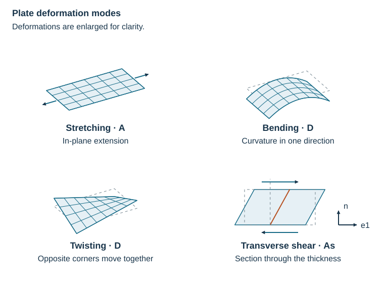

# First ABD Stiffness

Before adding ribs, calculate the stiffness of the skin that carries load between
them. Use a 2 mm aluminum plate with Young's modulus 70 GPa, Poisson's ratio 0.33,
and density 2700 kg/m³. These are illustrative material values.

```python
--8<-- "docs/examples/scripts/walkthrough.py:skin"
```

`skin` contains the plate stiffness and areal mass. Its four blocks answer four
physical questions:

| Block | Response | SI unit |
| --- | --- | --- |
| `A` | How much force per width produces stretching or in-plane shear? | N/m |
| `B` | How are stretching and bending coupled? | N |
| `D` | How much moment per width produces bending or twisting? | N m |
| `As` | How much transverse force per width produces shear? | N/m |

[](../assets/diagrams/deformations.svg "Open full-size diagram")

For this uniform plate, the reference surface is its midplane, so `B` is zero.
The familiar isotropic plate formulas give two useful checks:

$$
A_{11}=\frac{Et}{1-\nu^2}, \qquad
D_{11}=\frac{Et^3}{12(1-\nu^2)}.
$$

Here $E$ is Young's modulus in Pa and $t$ is thickness in m. The skin has
$A_{11}=157.109$ MN/m, $D_{11}=52.3697$ N m, and mass $\rho t=5.4$ kg/m².
Doubling its thickness would double its membrane stiffness and multiply its
bending stiffness by eight. These are the classical isotropic plate relations;
see [plate and laminate references](../references.md#plates-shells-and-laminates).

The entries in `A`, `B`, and `D` follow the order `11, 22, 12`; `As` uses `13, 23`.
For example, `skin.A[0, 0]` is $A_{11}$. The full
[load–strain relation](../theory/equivalent-stiffness.md) explains the remaining entries.

Next: [Add the stiffeners](first-homogenized-cell.md).

The [complete script](../examples/scripts/walkthrough.py) supplies all three
walkthrough pages and their output tables.
