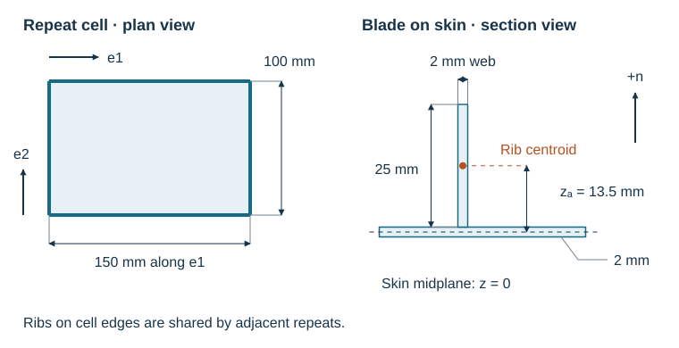

# First Homogenized Cell

Add two perpendicular families of blade ribs to the skin from the previous page.
Each blade is 25 mm high and 2 mm thick. The repeat rectangle is 150 mm along
`e1` and 100 mm along `e2`: ribs running along `e1` are therefore **100 mm apart**.



Use `blade_section` to calculate the rib's axial, bending, and torsional stiffness
from its material and dimensions. The blade centroid lies 12.5 mm above its base.
Adding half the skin thickness places it 13.5 mm above the skin midplane.

Continue the previous page's Python session:

```python
--8<-- "docs/examples/scripts/walkthrough.py:grid"
```

The blade helper leaves `kGAy` and `kGAz` unspecified, so this calculation adds
rib axial, bending, and torsional energy. Transverse shear stiffness comes from
the skin. Supply section shear stiffnesses when your section model provides them;
see [beam sections](../user-guide/beam-sections-and-cells.md).

`ValidityContext` describes a flat panel with a 27 mm overall height and a 1 m
response length. The repeat dimensions supply the pitch. The
[modeling guide](../theory/validity.md) explains how these scales enter the report.

## What the Ribs Add

--8<-- "docs/includes/walkthrough-comparison.md"

The ribs increase bending stiffness substantially because their material sits
away from the reference surface. For the `e1` ribs, with section area $A_r$,
centroidal second moment $I_y$, spacing $s$, and offset $z$:

$$
\Delta A_{11}=\frac{EA_r}{s},\qquad
\Delta B_{11}=\frac{EA_rz}{s},\qquad
\Delta D_{11}=\frac{E(I_y+A_rz^2)}{s}.
$$

These are the aligned-member terms in the
[energy assembly](../theory/tangent-plane-homogenization.md). The positive `B11`
means extension and bending are coupled about the skin midplane. Panel mass
counts the skin and both rib families: $5.4+1.35+0.90=7.65$ kg/m².

For these inputs, the report contains:

--8<-- "docs/includes/walkthrough-warnings.md"

The first compares the 150 mm pitch with the 1 m response length. The second
measures membrane–bending coupling that remains after the best common reference
shift. Both give information about this panel and its selected scales; the
[report guide](../theory/validity.md#interpreting-warnings) explains the thresholds.

Next: [Apply loads and save the result](use-the-result.md).
