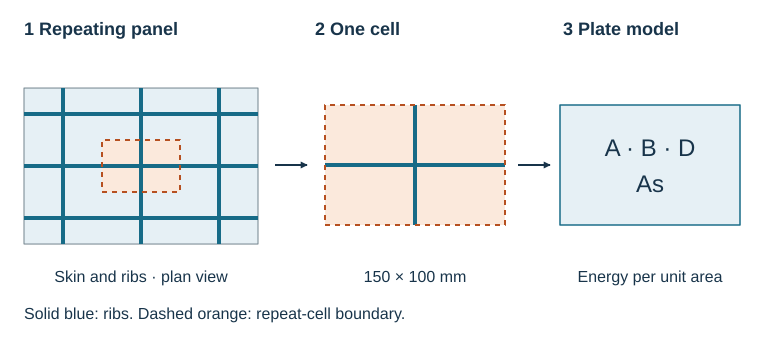

# Tensyl

Tensyl calculates equivalent stiffness for stiffened plates and shells. Describe
the skin, rib sections, and repeating pattern in Python, then use the resulting
plate stiffness to calculate strains, recover rib forces, compare designs, or
prepare a shell model.

## What Tensyl Computes

The result contains four blocks: **A** for stretching, **B** for coupling between
stretching and bending, **D** for bending and twisting, and **As** for transverse
shear. Together they relate loads per unit width to the deformation of the
panel. Tensyl also calculates panel mass when the skin and ribs have density data.

Build isotropic or laminated skins, derive beam stiffness from section geometry,
and arrange ribs as named grids, independent families, or a custom repeat cell.
The same stiffness can be rotated, moved to another reference surface, or placed
on a curved shell. Thermal loads, design sweeps, sampled stiffness maps, JSON/YAML
files, and an Abaqus section exporter connect the calculation to analysis work.

## First Workflow

Start with a **2 mm aluminum skin**, add **25 mm blade ribs**, then apply a
membrane load. The three-part walkthrough explains each input and checks the
result against familiar plate and smeared-rib formulas:

1. [Calculate the skin stiffness](getting-started/first-abd-stiffness.md).
2. [Add the stiffeners](getting-started/first-homogenized-cell.md).
3. [Apply loads and save the result](getting-started/use-the-result.md).

[Install Tensyl](getting-started/installation.md) first. The examples use metres,
newtons, kilograms, and basic Python.

## Documentation Map

| Your next question | Where to go |
| --- | --- |
| How does the stiffness represent a panel? | [How the model works](theory/equivalent-stiffness.md) |
| How do I describe my construction? | [Materials](user-guide/materials-and-laminates.md), [sections and cells](user-guide/beam-sections-and-cells.md) |
| How do I interpret and use the output? | [Using the results](user-guide/homogenization.md) |
| How was the calculation checked? | [Verification](validation/index.md) |
| What does a particular function accept? | [API reference](api/core.md) |

The [modeling guide](theory/validity.md) explains the deformation model and the
length scales used to interpret a homogenized panel.

!!! note "Documentation for current main"
    This handbook includes development features added after release 0.3.1.
    [Install from source](getting-started/installation.md#from-source) to run every
    example. The [changelog](https://github.com/srogachev95/Tensyl/blob/main/CHANGELOG.md)
    records which features are unreleased.
