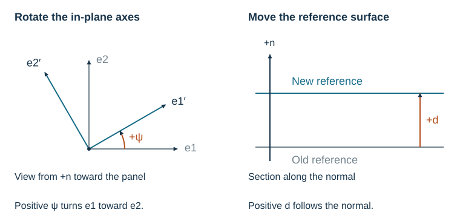

# Frames and Conventions

Establish the panel directions and reference surface before entering rib angles
or offsets. They determine the signs of coupling, curvature, and recovered loads.

The local directions `e1` and `e2` lie in the panel, with normal `n` completing
the right-handed frame: $\mathbf e_1\times\mathbf e_2=\mathbf n$.
For a cylinder, `e1` is axial, `e2` is circumferential, and `n` points outward.

## Member Angles

An angle of zero follows `e1`; $\pi/2$ follows `e2`. Positive angles turn from
`e1` toward `e2` about `+n`, counterclockwise when viewed from the positive-normal
side. A cylinder's stringers therefore use zero and its rings use $\pi/2$.

## Eccentricity Inputs

Eccentricity is the signed distance from the reference surface to the effective
rib centroid along `+n`. External cylinder ribs have positive offsets; internal
ribs have negative offsets. An external blade placed on a skin has
$z_a=t_\mathrm{skin}/2+z_c$ when the reference is the skin midplane.

`axial_eccentricity` locates the axial stiffness centroid. The optional
`shear_eccentricity` locates the in-plane shear response and defaults to the same
value. Face and core offsets in sandwich builders follow this sign convention.

## Rotation of ABD Stiffnesses

A rotation changes the directions used to express the stiffness. A reference
shift changes where membrane strain and moment are measured through thickness.



For a positive axis rotation $\psi$,

$$\mathbf e_1'=\cos\psi\,\mathbf e_1+\sin\psi\,\mathbf e_2,\qquad
\mathbf e_2'=-\sin\psi\,\mathbf e_1+\cos\psi\,\mathbf e_2.$$

Engineering strain and resultant transformations are different, but preserve work:

$$\boldsymbol\eta'=\mathbf T_\eta\boldsymbol\eta,\quad
\mathbf r'=\mathbf T_r\mathbf r,\quad
\mathbf C'=\mathbf T_r\mathbf C\mathbf T_\eta^{-1},\quad
\mathbf r'^T\boldsymbol\eta'=\mathbf r^T\boldsymbol\eta.$$

Continue with the result from the
[family example](../user-guide/rib-patterns.md#independent-families):

```python
--8<-- "docs/examples/scripts/panel_workflows.py:transform"
```

The 90° rotation swaps `A11` with `A22` and `D11` with `D22`. A field's
`orientation_rad` instead specifies the material direction relative to the
surface axes; see [constant fields](../user-guide/geometry-and-fields.md#constant-stiffness-field)
for that angle's meaning.

## Reference Surface

Moving the reference a distance $d$ along `+n` changes the blocks to

$$\mathbf A'=\mathbf A,\qquad
\mathbf B'=\mathbf B-d\mathbf A,\qquad
\mathbf D'=\mathbf D-2d\mathbf B+d^2\mathbf A.$$

`As` is unchanged. The old and new membrane strains satisfy
$\boldsymbol\epsilon_\mathrm{old}=\boldsymbol\epsilon_\mathrm{new}-d\boldsymbol\kappa$;
moments satisfy $\mathbf M_\mathrm{new}=\mathbf M_\mathrm{old}-d\mathbf N$.
These follow by substituting the shifted thickness coordinate into the
[plate energy](equivalent-stiffness.md). The transformation preserves the physical
response when loads and strains use the matching reference.

When combining faces or comparing results, first express every stiffness in the
same directions and at the same reference surface. `Frame2D.is_close` compares
directions to roundoff and ignores frame labels.

## Engineering Shear

`gamma12`, `gamma13`, and `gamma23` are engineering shear strains: twice their
tensor components. The third curvature `kappa12` is likewise the engineering
twist measure, so `gamma12(z) = gamma12(0) + z*kappa12`. Its work-conjugate moment
is `M12`. Use these conventions when transferring a matrix to another solver;
the [handoff guide](../user-guide/solver-handoff.md) describes the checks.
