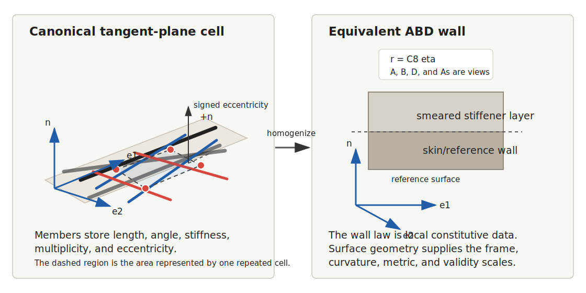

# Tangent-Plane Homogenization

Tangent-plane homogenization computes a local equivalent ABD stiffness for a
repeating stiffened cell that is treated as flat in the local tangent plane.
The cell is assembled in the local `e1`-`e2` plane. Surface curvature is handled
later by geometry embedding and validity checks, not by the first local cell
stiffness assembly.

For a cell with area $A_\text{cell}$, a beam member contributes:

$$
\Delta\mathbf C_m =
\frac{\mu_m L_m}{A_\text{cell}}
\mathbf T_m^T\mathbf K_m\mathbf T_m.
$$

Here:

- $\mu_m$ is multiplicity;
- $L_m$ is member length;
- $\mathbf K_m$ is the member stiffness matrix;
- $\mathbf T_m$ is the *member strain map*: it projects the stiffness's generalized
  strain onto each member's beam strain. This map is the hinge of the whole
  method, and it is referenced by name in the diagnostics below.

The equivalent tangent is:

$$
\mathbf C_\text{stiffness}
=
\mathbf C_\text{skin}
+
\sum_m \Delta\mathbf C_m.
$$

The energy method is Tensyl's reference homogenizer because the assembled
member contribution is symmetric by construction and works for graph-like
canonical cells. Direct equilibrium-compatibility formulas are available for
supported straight stiffener-family cases and are tested against the energy
path.

This follows the equivalent-plate idea used by Nemeth for stiffened laminated
plates and plate-like lattices. Tensyl treats those formulas as mechanics
guidance and keeps the energy path as the executable reference.

*Adapted from Nemeth, NASA/TP-2011-216882, figures 6, 8, and 9; full citation
in [References](../references.md).*

## How Geometry Enters The ABD Law

The tangent-plane homogenizer computes a local constitutive law. At a surface
point, the shell or plate generalized strains and resultants are interpreted in
the point's local right-handed frame:

$$
\{\mathbf e_1,\mathbf e_2,\mathbf n\}.
$$

The local law remains the same kind of object everywhere:

$$
\mathbf r = \mathbf C_\text{stiffness}\boldsymbol\eta.
$$

Defining a barrel, dome, cone, or ellipsoid does not by itself bend the
stiffener cell or insert curvature terms into the matrix above. Geometry enters
through three separate mechanisms:

- the surface supplies the local frame, metric, curvature, Jacobian, and
  positive minimum radius used to interpret and audit the law;
- a stiffness field decides which ABD stiffness is present at each surface
  point;
- a later shell, buckling, or sizing workflow uses the surface geometry to
  form equilibrium, loads, boundary conditions, and failure checks.

That separation is deliberate. The homogenizer answers a local constitutive
question: "what resultants follow from these generalized strains in this tangent
plane?" The surface answers a geometric question: "where is that tangent plane,
which directions are local 1/2/n, and how curved is the midsurface?" A solver
answers the global equilibrium question. Mixing those jobs would make the
numbers harder to trust, and not in an interesting way.

The public stiffness-field helpers implement this separation directly:

- `ConstantStiffnessField` returns the same canonical `C8` tangent at each
  point and rebinds it to `surface.point_at(u, v).frame`. The numeric matrix is
  unchanged; the metadata and local frame describe where and how to read it.
- `HomogenizedStiffnessField` calls a user-supplied cell factory at each surface
  point. The ABD stiffness can change pointwise if the factory changes pitch,
  member angle, eccentricity, section, material, or laminate with the local
  geometry.
- `ABDAtlas` stores sampled linear ABD stiffnesses and interpolates the
  canonical `C8` payload. The interpolated tangent is then bound to the target
  surface-point frame.

For a cylinder, `e1` is axial, `e2` is circumferential, and `n` is outward. A
longitudinal stringer therefore has angle `0`, and a ring rib has angle
`pi/2`. The cylinder radius does not change the constant-field tangent, but it
does set the curvature scale used by validity ratios such as
$p/R_\text{min}$ and $h_s/R_\text{min}$.

For an ellipsoid, the same rule holds, but the frame and curvature vary over the
surface. Uniform parameter spacing is not uniform physical pitch on a triaxial
ellipsoid. If stiffener pitch or orientation is meant to follow physical
distance, the pointwise cell factory or atlas samples must encode that choice.
Tensyl will not infer a geodesic stiffener layout from the word "ellipsoid".

This is why the method is generalizable under its stated assumptions. Any smooth
surface that can provide a local tangent frame and curvature scale can host the
same local ABD law. The approximation is appropriate when the modeled response
is scale separated from stiffener height, stiffener pitch, and local curvature,
as discussed in [Validity Limits](validity.md). The mechanics basis follows the
equivalent-plate, first-order plate/shell, differential-geometry, and
homogenization sources listed in [References](../references.md).

## Inputs

- `skin` is an `ABDStiffness` for the unstiffened skin or laminate.
- `BeamSection` supplies centroidal beam stiffness products. Tensyl does not
  currently compute those values from cross-section dimensions.
- `BeamMember` supplies member length, angle, eccentricity, and multiplicity
  inside a finite canonical cell.
- `StiffenerFamily` supplies angle, spacing, eccentricity, and multiplicity for
  the direct equilibrium-compatibility path.
- `CanonicalUnitCell.area` is the tangent-plane area represented by one
  repeated cell.

## Beam Section Quantities

`BeamSection` stores centroidal member-local stiffnesses:

| Quantity | Meaning | Common units, US customary |
| --- | --- | --- |
| `EA` | axial stiffness | `lbf` |
| `EIy` | bending stiffness about member-local `y` | `lbf*in^2` |
| `EIz` | bending stiffness about member-local `z` | `lbf*in^2` |
| `GJ` | torsional stiffness | `lbf*in^2` |
| `kGAy` | in-plane shear stiffness | `lbf` |
| `kGAz` | transverse shear stiffness | `lbf` |

Omitted shear stiffnesses contribute zero in the current homogenizer and are
recorded as assumptions in the result.

`BeamSection` asks for stiffness products (`EA`, `EIy`, `EIz`, `GJ`, `kGAy`,
`kGAz`) because the current homogenizer consumes centroidal beam stiffnesses.
Section-property calculation from raw cross-section geometry is outside the
current API.

## Diagnostics

The homogenizer returns `HomogenizationResult`, not just an ABD stiffness. The result
records:

- symmetry, positive-semidefinite status, rank, member count, and cell area;
- assumptions attached to the member strain map and section inputs;
- a `ValidityReport` with scale-separation ratios and warning codes.

!!! note "Two methods agreeing is necessary, not sufficient"
    Energy-vs-direct agreement is a good sign, but it is not proof. Both paths
    share the same member strain map, so they can agree and still be wrong
    together. For high-consequence use, you still need independent literature,
    test, or finite-element evidence.

## Limits

The first homogenizer is a tangent-plane model. It does not model local joints,
fasteners, stiffener crippling, curved stiffener geodesics, or full shell
equilibrium. Use geometry validity ratios such as `h_over_R`, `p_over_R`, and
`p_over_L_response` to decide whether the local flat-cell assumption is
reasonable for the intended response mode.
