# Beam Sections and Cells

Stiffener homogenization begins with member-local beam-section stiffnesses.
If you already have centroidal stiffness products from a handbook, section
solver, or CAD workflow, pass them directly:

```python
from tensyl import BeamSection

section = BeamSection(
    EA=3.2e6,
    EIy=2.4e4,
    EIz=6.5e3,
    GJ=4.0e3,
    kGAy=1.1e6,
    kGAz=0.9e6,
)
```

Tensyl asks for stiffness products instead of raw dimensions because the current
homogenizer consumes centroidal beam stiffnesses.

## Geometry-Derived Sections

For common isotropic thin-wall stiffeners, Tensyl can compute those products
from section geometry. The section constructors use member-local `(y, z)`
coordinates:

- `+z` is the same direction as wall `+n`;
- `z = 0` is the section construction datum;
- for the named external stiffeners below, `z = 0` is the skin outer face where
  the stiffener touches the skin;
- `centroid_z` is measured from that construction datum.

The wall reference surface is often the skin mid-surface, not the skin outer
face. For an external stiffener sitting on the `+n` face of an `isotropic_plate`,
the member eccentricity is therefore:

$$
e = \frac{t_\mathrm{skin}}{2} + z_c .
$$

Using `section.centroid_z` directly is correct only when your section datum
already coincides with the wall reference surface.

The diagrams below are schematic section-coordinate drawings. They define Tensyl
input conventions; they are not fabrication drawings, bend-radius details, or a
promise that local stress recovery has suddenly become easy.

```python
from tensyl import IsotropicMaterial, blade_section, hat_section

aluminum = IsotropicMaterial(E=10.6e6, nu=0.33)

blade = blade_section(
    material=aluminum,
    height=0.50,
    thickness=0.050,
    shear_correction_y=5.0 / 6.0,
    shear_correction_z=5.0 / 6.0,
)

hat = hat_section(
    material=aluminum,
    web_height=0.50,
    web_thickness=0.050,
    crown_width=0.40,
    crown_thickness=0.050,
    flange_width=0.20,
    flange_thickness=0.050,
)
```

Geometry-derived sections expose both the computed `BeamSection` and the
section centroid:

```python
from tensyl import EnergyHomogenizer, isotropic_plate, orthogrid_cell

skin_thickness = 0.080
skin = isotropic_plate(aluminum, thickness=skin_thickness)
skin_face_offset = 0.5 * skin_thickness

cell = orthogrid_cell(
    skin=skin,
    stringer_section=hat.section,
    rib_section=blade.section,
    stringer_spacing=6.0,
    rib_spacing=8.0,
    stringer_eccentricity=skin_face_offset + hat.centroid_z,
    rib_eccentricity=skin_face_offset + blade.centroid_z,
)

result = EnergyHomogenizer().compute(cell)
```

The named helpers are convenience wrappers over `thin_wall_section`, which
accepts custom `ThinWallSegment` layouts in member-local `(y, z)` coordinates.
Use this for a stiffener shape that is just ordinary enough to be useful and just
odd enough to avoid having its own constructor.

### Blade Section

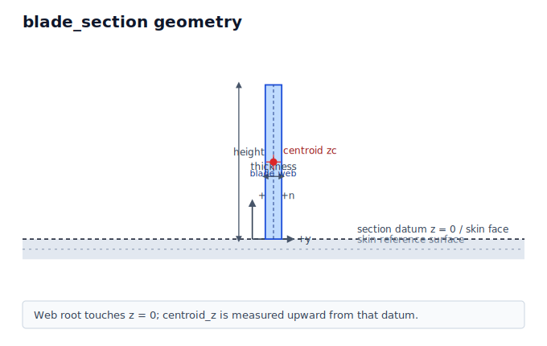

`blade_section` creates one vertical web rooted at `z = 0`.

| Input | Meaning |
| --- | --- |
| `height` | Web midline height measured from the construction datum in `+z`. |
| `thickness` | Web thickness measured in the local `y` direction. |

### Tee Section

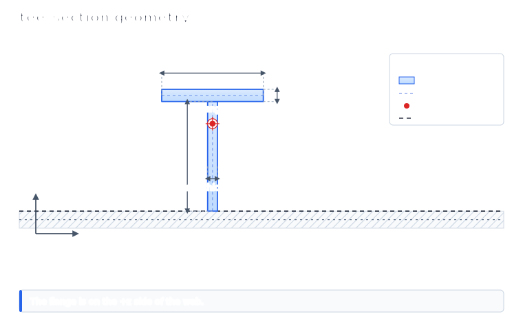

`tee_section` creates a web at `y = 0` with a centered top flange. The flange is
above the web, not touching the skin.

| Input | Meaning |
| --- | --- |
| `web_height` | Web midline height from `z = 0` to the flange midline junction. |
| `web_thickness` | Web thickness measured in the local `y` direction. |
| `flange_width` | Full flange midline width in the local `y` direction. |
| `flange_thickness` | Flange thickness measured in the local `z` direction. |

### Zee Section

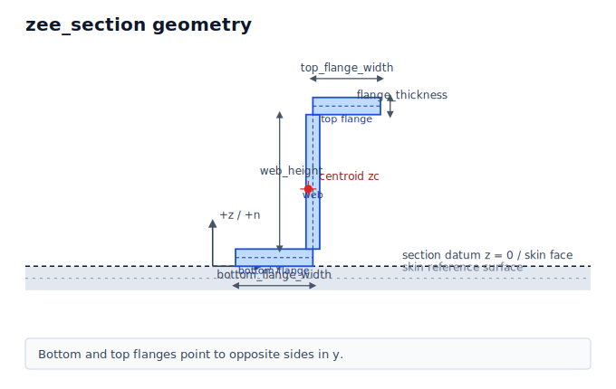

`zee_section` creates a lower flange at the skin-face datum and an upper flange
on the opposite side of the web. The lower flange extends toward `-y`; the upper
flange extends toward `+y`.

| Input | Meaning |
| --- | --- |
| `web_height` | Web midline height between the lower and upper flange regions. |
| `web_thickness` | Web thickness measured in the local `y` direction. |
| `bottom_flange_width` | Lower flange width extending toward `-y`. |
| `top_flange_width` | Upper flange width extending toward `+y`. |
| `flange_thickness` | Thickness used for both flanges, measured in local `z`. |

### Channel Section

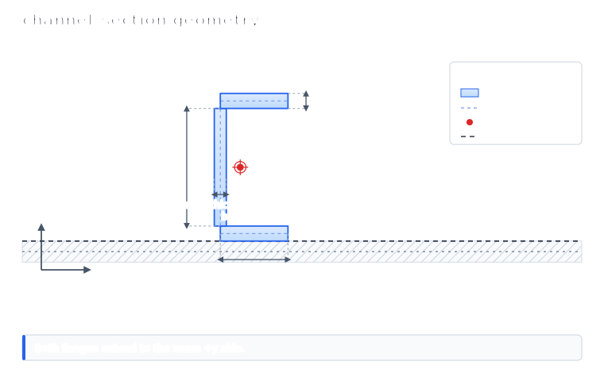

`channel_section` creates lower and upper flanges on the same side of the web.
Both flanges extend toward `+y`; the lower flange sits at the skin-face datum.

| Input | Meaning |
| --- | --- |
| `web_height` | Web midline height between the lower and upper flange regions. |
| `web_thickness` | Web thickness measured in the local `y` direction. |
| `flange_width` | Width of each flange extending toward `+y`. |
| `flange_thickness` | Thickness used for both flanges, measured in local `z`. |

### Hat Section

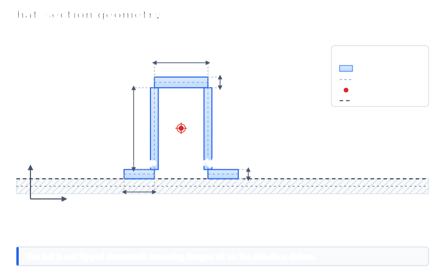

`hat_section` creates an open hat that rises in `+z`. The two lower mounting
flanges sit on the `z = 0` construction datum, so this is the usual external
hat orientation with flanges touching the skin face. It is not flipped downward
into the skin.

| Input | Meaning |
| --- | --- |
| `web_height` | Height of the two side webs from the mounting flanges toward the crown. |
| `web_thickness` | Thickness of each side web, measured in local `y`. |
| `crown_width` | Width of the top crown between the two web centerlines. |
| `crown_thickness` | Crown thickness measured in local `z`. |
| `flange_width` | Width of each lower mounting flange. |
| `flange_thickness` | Thickness of each lower mounting flange, measured in local `z`. |

### Custom Thin-Wall Sections

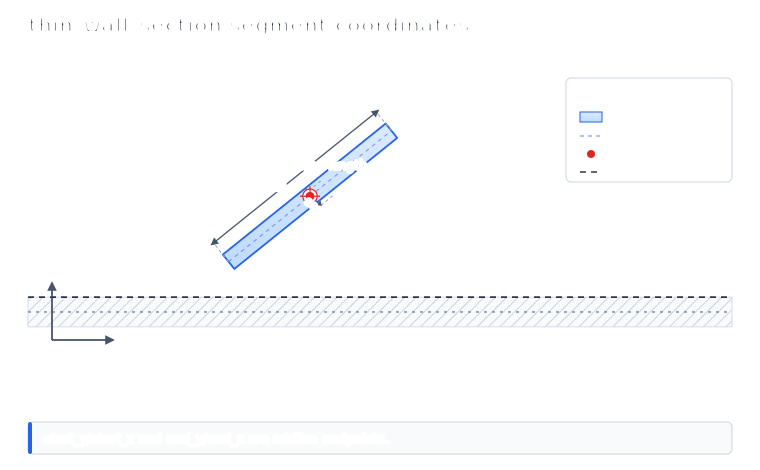

Use `thin_wall_section` with `ThinWallSegment` values for custom open thin-wall
layouts:

```python
from tensyl import ThinWallSegment, thin_wall_section

custom = thin_wall_section(
    material=aluminum,
    segments=(
        ThinWallSegment(-0.5, 0.0, 0.5, 0.0, 0.050, label="flange"),
        ThinWallSegment(0.0, 0.0, 0.0, 0.75, 0.040, label="web"),
    ),
)
```

`start_y`, `start_z`, `end_y`, and `end_z` are segment midline endpoint
coordinates. `thickness` is measured normal to that midline in the same `(y, z)`
section plane.

This is a thin-wall idealization, not an exact solid model of the corner
material. When two segments meet at right angles, the coordinates describe the
meeting of their midlines. That is the same convention a shell or plate model
would usually use for a stiffener wall. If the local corner material, weld
radius, flange/web overlap, or manufacturing detail matters to the section
properties, compute the section externally and pass Tensyl a `BeamSection`
instead.

For US customary examples:

- `EA`, `kGAy`, and `kGAz` use `lbf`;
- `EIy`, `EIz`, and `GJ` use `lbf*in^2`;
- cell dimensions use `in`.

## Named Cells

Tensyl provides constructors for common tangent-plane patterns:

- `unidirectional_cell`;
- `orthogrid_cell`;
- `braced_orthogrid_cell`;
- `equilateral_isogrid_cell`;
- `isosceles_triangle_grid_cell`;
- `kagome_cell`;
- `hexagonal_grid_cell`;
- `star_cell`;
- sandwich-core variants.

Named constructors are convenience layers over canonical `BeamMember`
contributions. They do not model joint details, intersection stresses, or local
crippling.

The treatise figures below show the kind of repeated cell each named constructor
is reducing to member contributions. They are topology references, not a promise
that the constructor reproduces every label, dimension convention, or special
case in the original report.

| Constructor family | Treatise topology |
| --- | --- |
| `braced_orthogrid_cell` | 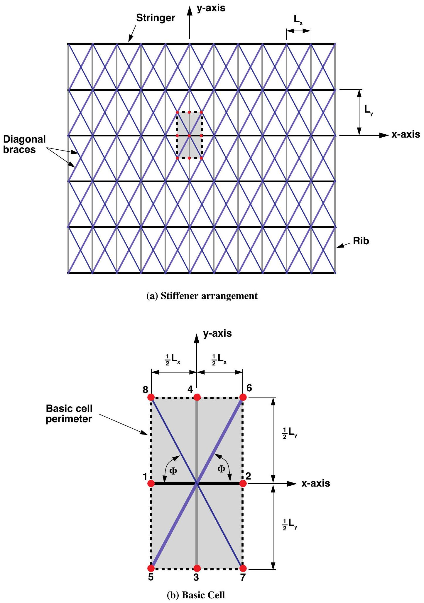 |
| `isosceles_triangle_grid_cell` | 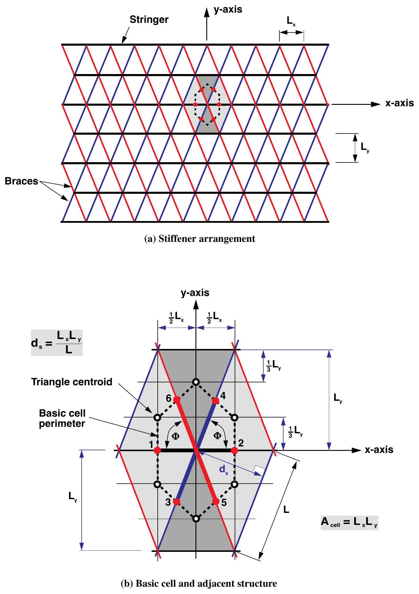 |
| `kagome_cell` | 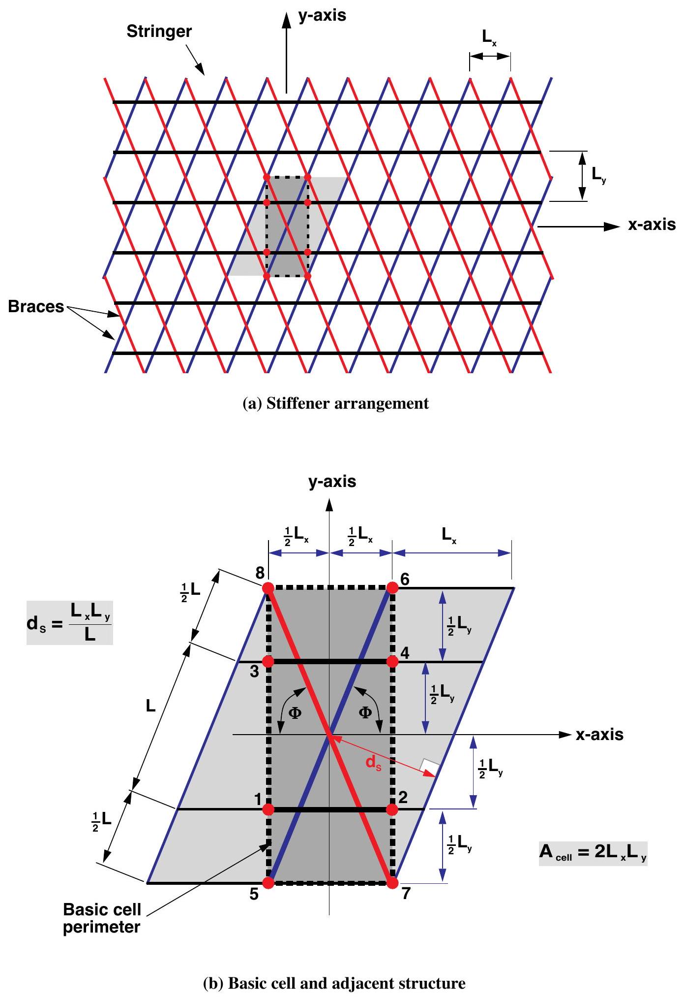 |
| `hexagonal_grid_cell` | 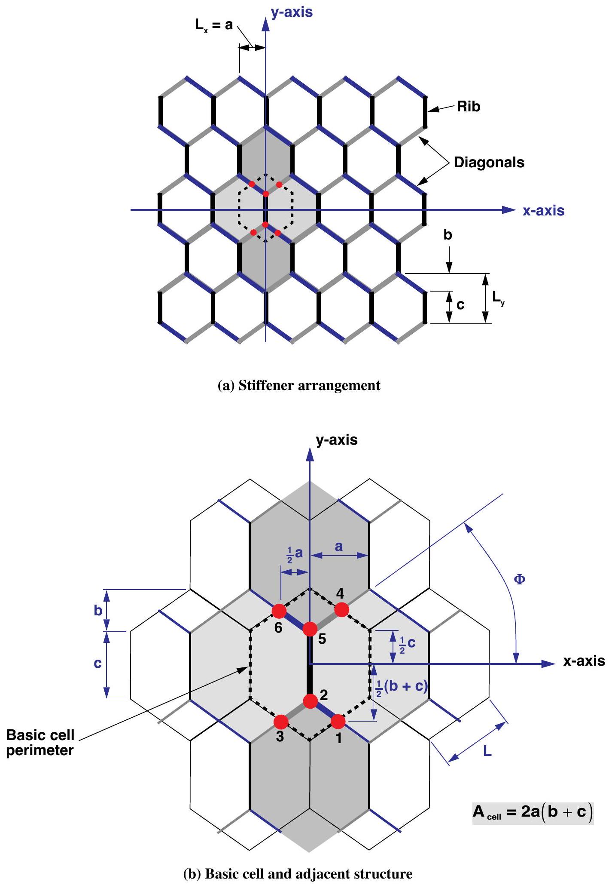 |
| `star_cell` | 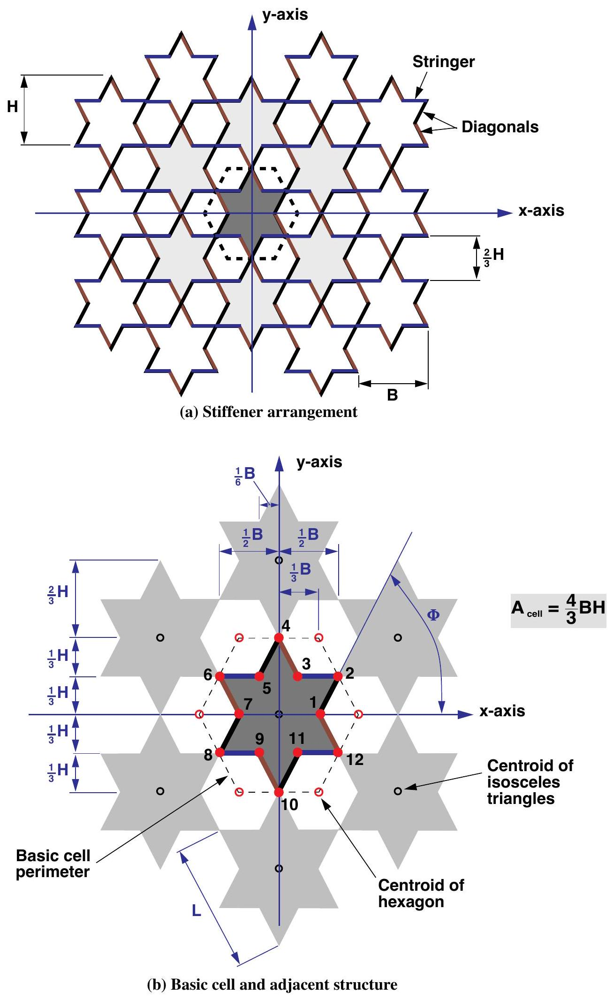 |

*Source for topology figures: Nemeth, NASA/TP-2011-216882, figures 14, 17, 18,
21, and 23; full citation in [References](../references.md).*

## Angles and Eccentricity

Angles are measured in the local frame. `0` points along `e1`, `pi/2`
points along `e2`, and positive angles follow the positive rotation convention
about `n`.

Every eccentricity is signed along `+n` from the reference surface to the
member centroid. For an outward-normal cylinder, an external stringer has
positive `stringer_eccentricity`; an internal stringer has negative
eccentricity.

For a geometry-derived stiffener, `centroid_z` is measured from the section's own
construction datum. If that datum is not the wall reference surface, shift the
value before passing it to the cell constructor. A skin mid-surface reference and
an outer-face stiffener datum differ by half the skin thickness. Tensyl is
helpful here, but it is not a mind reader.

!!! warning "A wrong eccentricity sign is silently wrong"
    The sign changes the coupling block `B`, so flipping it produces a different
    physical ABD stiffness — with no validation error to catch it. See
    [Frames and Conventions](../theory/conventions.md) for the full sign rule.

## Graph Cells

Use `graph_unit_cell` when a named constructor is not enough. It converts local
tangent-plane nodes and edges into canonical beam members.

```python
from tensyl import CellEdge, CellNode, graph_unit_cell

cell = graph_unit_cell(
    area=48.0,
    skin=skin,
    nodes=(
        CellNode(0.0, 0.0),
        CellNode(6.0, 0.0),
        CellNode(0.0, 8.0),
    ),
    edges=(
        CellEdge(0, 1, section, eccentricity=0.45),
        CellEdge(0, 2, section, eccentricity=0.45),
    ),
)
```

Node coordinates and area must use the same length unit.

Next: [Frames and Conventions](../theory/conventions.md).
