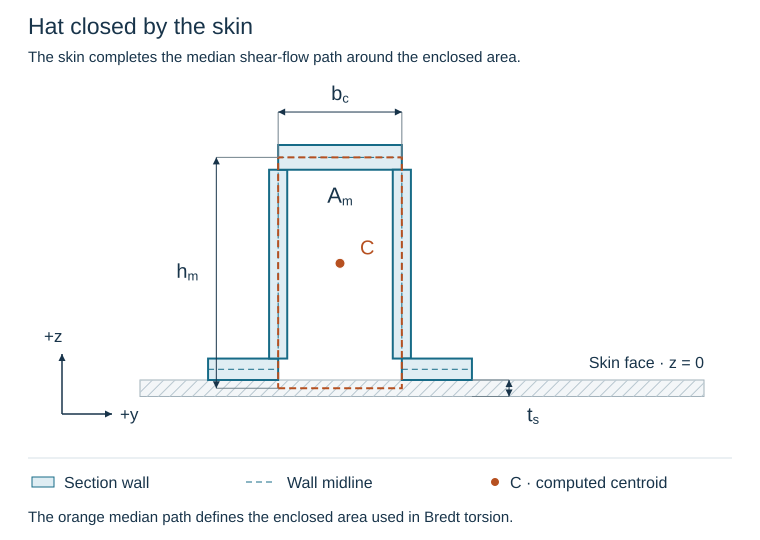

# Beam Sections and Cells

Describe a rib in two steps: calculate its cross-section stiffness, then place
that section in the panel's repeating pattern. This page covers the section;
[rib patterns](rib-patterns.md) covers placement and repeat-area accounting.

## Geometry-Derived Sections

For a blade, tee, zee, channel, or hat, pass the material and dimensions to a
section helper. Its `.section` contains the `BeamSection` used by the cell;
`.centroid_z` locates the centroid relative to the section's construction datum.
The [walkthrough](../getting-started/first-homogenized-cell.md) uses a blade.

Section coordinates are `(y, z)`, transverse to the rib's axis. Positive `z`
follows panel `+n`. Named external sections place `z = 0` at the skin outer face,
so a skin-midplane reference gives

$$z_a=t_\mathrm{skin}/2+z_c.$$

[](../assets/diagrams/repeat-offset.svg "Open full-size diagram")

Each wall is a rectangular strip with area $A_i=L_it_i$. Tensyl sums the areas,
calculates the area-weighted centroid, and applies the parallel-axis theorem:

$$A=\sum_i A_i,\quad z_c=\frac{\sum_i A_iz_i}{A},\quad
I_y=\sum_i[I_{y,i}^{c}+A_i(z_i-z_c)^2].$$

It similarly calculates $y_c$, $I_z$, and $I_{yz}$, including each strip's rotated
centroidal inertia. For an isotropic section, multiply by $E$ to obtain axial
and bending stiffnesses; see [section-property sources](../references.md#section-properties).

| `BeamSection` input | SI unit | Meaning |
| --- | --- | --- |
| `EA` | N | Axial stiffness |
| `EIy`, `EIz`, `EIyz` | N m² | Centroidal bending stiffnesses and product |
| `GJ` | N m² | Torsional stiffness |
| `kGAy`, `kGAz` | N | Optional in-plane and transverse shear stiffnesses |
| `mass_per_length` | kg/m | Rib mass per length |
| `thermal_expansion` | 1/K | Uniform axial thermal expansion |

You can also supply these products directly from a section solver using
`BeamSection(...)`. The [member energy map](../theory/tangent-plane-homogenization.md#beam-section-quantities)
shows which section properties enter the plate stiffness.

For an open thin-wall section, $J\approx\sum_i L_it_i^3/3$ and the torsional stiffness is the product of shear modulus $G$ and $J$. Optional `shear_correction_y` and
`shear_correction_z` give $kGA=\kappa GA$; omitted corrections leave those
member contributions zero. Density supplies mass automatically.

### Blade Section

The drawings use the wall coordinates returned by the section builders. Blue
dashes mark wall midlines; **C** marks the calculated centroid. Dimension symbols
map to Python inputs in the tables below. Click a drawing to open it at full size.

[](../assets/sections/blade-section.svg "Open full-size diagram")

`blade_section` creates one vertical web rooted at `z = 0`.

| Symbol | Input | Meaning |
| --- | --- | --- |
| $h$ | `height` | Web height from the skin face to the free end in `+z`. |
| $t$ | `thickness` | Web thickness in the local `y` direction. |

### Tee Section

[](../assets/sections/tee-section.svg "Open full-size diagram")

`tee_section` creates a web at `y = 0` with a centered top flange.

| Symbol | Input | Meaning |
| --- | --- | --- |
| $h_w$ | `web_height` | Clear web height from `z = 0` to the underside of the flange. |
| $t_w$ | `web_thickness` | Web thickness in local `y`. |
| $b_f$ | `flange_width` | Full flange width in local `y`. |
| $t_f$ | `flange_thickness` | Flange thickness in local `z`. |

### Zee Section

[](../assets/sections/zee-section.svg "Open full-size diagram")

`zee_section` creates a lower flange at the skin-face datum and an upper flange
on the opposite side of the web. The lower flange extends toward `-y`; the upper
flange extends toward `+y`.

| Symbol | Input | Meaning |
| --- | --- | --- |
| $h_w$ | `web_height` | Clear distance between the facing surfaces of the flanges. |
| $t_w$ | `web_thickness` | Web thickness in local `y`. |
| $b_b$ | `bottom_flange_width` | From the web midline to the lower flange tip in `-y`. |
| $b_t$ | `top_flange_width` | From the web midline to the upper flange tip in `+y`. |
| $t_f$ | `flange_thickness` | Thickness of both flanges in local `z`. |

### Channel Section

[](../assets/sections/channel-section.svg "Open full-size diagram")

`channel_section` creates lower and upper flanges on the same side of the web.
Both flanges extend toward `+y`; the lower flange sits at the skin-face datum.

| Symbol | Input | Meaning |
| --- | --- | --- |
| $h_w$ | `web_height` | Clear distance between the facing surfaces of the flanges. |
| $t_w$ | `web_thickness` | Web thickness in local `y`. |
| $b_f$ | `flange_width` | From the web midline to each flange tip in `+y`. |
| $t_f$ | `flange_thickness` | Thickness of both flanges in local `z`. |

### Hat Section

[](../assets/sections/hat-section.svg "Open full-size diagram")

`hat_section` creates an open hat that rises in `+z`. The two lower mounting
flanges sit on the `z = 0` construction datum, so this is the usual external
hat orientation with flanges touching the skin face.

| Symbol | Input | Meaning |
| --- | --- | --- |
| $h_w$ | `web_height` | Clear distance from the mounting flange's top face to the crown's underside. |
| $t_w$ | `web_thickness` | Thickness of each side web in local `y`. |
| $b_c$ | `crown_width` | Crown width between the web midlines. |
| $t_c$ | `crown_thickness` | Crown thickness in local `z`. |
| $b_f$ | `flange_width` | From each web midline outward to the mounting flange tip. |
| $t_f$ | `flange_thickness` | Mounting flange thickness in local `z`. |

### Custom Thin-Wall Sections

[](../assets/sections/thin-wall-segment.svg "Open full-size diagram")

Give the endpoints of each wall **midline**, with thickness $t$ normal to that
line. The segment length $L$ is calculated from those endpoints.
This example continues with `aluminum` defined in the [material example](materials-and-laminates.md#uniform-temperature-changes):

```python
--8<-- "docs/examples/scripts/materials_sections.py:custom"
```

The midlines define a thin-wall idealization. A section solver can supply the
stiffness products when corner buildup or manufacturing detail affects them.

### Laminated Walls

A composite rib can give each wall a laminate. The laminate's direction 1 runs
along the rib; direction 2 follows the wall midline. Use the symmetric stack
from the [laminate example](materials-and-laminates.md#orthotropic-laminate):

```python
--8<-- "docs/examples/scripts/materials_sections.py:wall"
```

A ply stack must match the segment thickness. An `ABDStiffness` can also be
supplied when its thickness is known to match the wall.

With membrane compliance $a=A^{-1}$ and wall thickness $t$, the reduction uses

$$E_x=\frac{1}{a_{11}t},\qquad G=\frac{1}{a_{66}t}.$$

These are the moduli for a wall free to contract laterally, following the
laminate compliance construction in [NASA RP-1351](https://ntrs.nasa.gov/citations/19950009349).
The beam's elastic centroid is weighted by $E_i A_i$, and each rectangular
strip contributes its own inertia plus the parallel-axis term, weighted by
$E_i$. Thus `centroid_z` is the axial stiffness centroid, not necessarily the
mass or area centroid. Use it when setting axial eccentricity. Open torsion is
approximated by $GJ=\sum_i G_i L_i t_i^3/3$.

This membrane-equivalent reduction uses uniform strips. Nonzero `B` and `A16/A26` coupling are refused (relative tolerance
$10^{-12}$), because `BeamSection` cannot carry those couplings. `D` and `As`
are unused and beam shear stiffnesses remain unspecified. Mass is included
only when every wall supplies areal mass.

### Hats Closed by the Skin

[](../assets/sections/closed-hat-section.svg "Open full-size diagram")

An attached skin can close the hat's shear-flow path. Compare an open hat with
one closed by a 2 mm skin, using the same aluminum material:

```python
--8<-- "docs/examples/scripts/materials_sections.py:hat"
```

The example gives `GJ` of 7.01754 N m² for the open hat and 1350.40 N m² for the
closed path. Area, centroid, bending properties, and rib mass stay the same.

Pass `closure_thickness` to `hat_section` when the isotropic skin closes a
continuous shear-flow path. The closure uses the hat material's shear modulus.
For crown width $b_c$, median height $h_m$, web thickness $t_w$, crown thickness
$t_c$, and closure thickness $t_s$, the selected torsion constant is

$$A_m=b_c h_m,\qquad
J=\frac{4A_m^2}{2h_m/t_w+b_c/t_c+b_c/t_s},\qquad
h_m=h_w+t_f+\frac{t_c+t_s}{2}.$$

Here $t_s$ is `closure_thickness`; the orange path encloses $A_m$.

This is the single-cell, thin-wall [Bredt formula](https://ocw.mit.edu/courses/16-20-structural-mechanics-fall-2002/a58ea050460c29f7389ff55e084521ed_ho3.pdf)
using median-line area. It replaces the open-strip estimate; the small open
mounting-flange contribution is neglected. The skin midplane lies at
`z = -closure_thickness/2` relative to the existing mounting datum. The closure
changes only `properties.J` and `section.GJ`: the skin's area, bending, and mass
stay in the plate model. For an independently calculated constant, construct
`ThinWallSection(..., torsion_constant=J)`.

The closure affects torsion only: the skin area and mass remain in the plate
model. Its shear energy also participates in the closed-cell flow, so account
for that shared contribution when combining the closed `GJ` with the skin's
plate energy. The [SP-8007 discussion](../validation/sp8007-reconciliation.md#which-j-should-be-used)
explains the two idealizations. This option uses perfect bonding and free warping.

<span id="named-cells"></span>
<span id="angles-and-eccentricity"></span>
<span id="graph-cells"></span>
<span id="check-the-drawn-member-density"></span>
## Place the Sections in a Panel

Continue with [named patterns, independent families, and custom graph cells](rib-patterns.md).
That page also covers the drawn-versus-modeled rib-density audit. The
[axis and eccentricity conventions](../theory/conventions.md) apply to every builder.

[Complete executable section examples](../examples/scripts/materials_sections.py).
