# Beam Sections and Cells

Stiffener homogenization begins with member-local beam-section stiffnesses.
If you already have centroidal stiffness products from a handbook, section
solver, or CAD workflow, pass them directly:

```python
from tensyl import BeamSection

section = BeamSection(
    EA=3.2e6,
    EIy=2.4e4,
    EIz=6.5e3,
    GJ=4.0e3,
    kGAy=1.1e6,
    kGAz=0.9e6,
)
```

Tensyl asks for stiffness products instead of raw dimensions because the current
homogenizer consumes centroidal beam stiffnesses.

Add `mass_per_length` when you want the homogenized panel to report its areal
mass. The homogenizer only reports panel mass when the skin and every member
section supply one, because a total that quietly leaves out the stiffeners is
worse than no total at all. The geometry-derived sections below fill it in
from the material density.

## Geometry-Derived Sections

For common isotropic thin-wall stiffeners, Tensyl can compute those products
from section geometry. The section constructors use member-local `(y, z)`
coordinates:

- `+z` is the same direction as wall `+n`;
- `z = 0` is the section construction datum;
- for the named external stiffeners below, `z = 0` is the skin outer face where
  the stiffener touches the skin;
- `centroid_z` is measured from that construction datum.

The wall reference surface is often the skin mid-surface, not the skin outer
face. For an external stiffener sitting on the `+n` face of an `isotropic_plate`,
the member eccentricity is therefore:

$$
e = \frac{t_\mathrm{skin}}{2} + z_c .
$$

Using `section.centroid_z` directly is correct only when your section datum
already coincides with the wall reference surface.

The diagrams below are schematic section-coordinate drawings. They define Tensyl
input conventions; they are not fabrication drawings, bend-radius details, or a
substitute for local stress recovery.

```python
from tensyl import IsotropicMaterial, blade_section, hat_section

aluminum = IsotropicMaterial(E=10.6e6, nu=0.33)

blade = blade_section(
    material=aluminum,
    height=0.50,
    thickness=0.050,
    shear_correction_y=5.0 / 6.0,
    shear_correction_z=5.0 / 6.0,
)

hat = hat_section(
    material=aluminum,
    web_height=0.50,
    web_thickness=0.050,
    crown_width=0.40,
    crown_thickness=0.050,
    flange_width=0.20,
    flange_thickness=0.050,
)
```

Geometry-derived sections expose both the computed `BeamSection` and the
section centroid:

```python
from tensyl import EnergyHomogenizer, isotropic_plate, orthogrid_cell

skin_thickness = 0.080
skin = isotropic_plate(aluminum, thickness=skin_thickness)
skin_face_offset = 0.5 * skin_thickness

cell = orthogrid_cell(
    skin=skin,
    e1_section=hat.section,
    e2_section=blade.section,
    e1_pitch=8.0,
    e2_pitch=6.0,
    e1_axial_eccentricity=skin_face_offset + hat.centroid_z,
    e2_axial_eccentricity=skin_face_offset + blade.centroid_z,
)

result = EnergyHomogenizer().compute(cell)
```

The named helpers are convenience wrappers over `thin_wall_section`, which
accepts custom `ThinWallSegment` layouts in member-local `(y, z)` coordinates.
Use this for a stiffener shape that is just ordinary enough to be useful and just
odd enough to avoid having its own constructor.

Tensyl computes the section properties as a composite-area problem. Each
`ThinWallSegment` becomes a rectangular strip whose midline is the supplied
segment and whose thickness is measured normal to that line. For strip `i`,

$$
A_i = l_i t_i .
$$

The section centroid is the area-weighted average of the strip centroids:

$$
y_c = \frac{\sum_i A_i y_i}{\sum_i A_i},
\qquad
z_c = \frac{\sum_i A_i z_i}{\sum_i A_i}.
$$

Each strip first contributes its own centroidal inertia. Tensyl rotates that
local strip inertia into the member-local `(y, z)` axes, then shifts it to the
section centroid with the parallel-axis theorem:

$$
I_y = \sum_i \left(I_{y,i}^{c} + A_i (z_i-z_c)^2\right),
$$

$$
I_z = \sum_i \left(I_{z,i}^{c} + A_i (y_i-y_c)^2\right),
$$

and

$$
I_{yz} = \sum_i \left(I_{yz,i}^{c} + A_i (y_i-y_c)(z_i-z_c)\right).
$$

Those are area properties only. For an isotropic section, Tensyl converts them
to stiffness products afterward with `EA = E A`, `EIy = E Iy`, `EIz = E Iz`, and
`EIyz = E Iyz`. This is the standard composite-area and parallel-axis calculation
for second moments of area; the section-property reference is listed in
[References](../references.md).

### Laminated Walls

A composite rib needs a different axial modulus for each wall. Build a
`LaminatedWallSegment(geometry, laminate)` from a `ThinWallSegment` and either
an `ABDStiffness` or a tuple of `Ply` objects. A ply stack must match the wall
thickness. For a supplied ABD, the caller is responsible for that thickness.
Laminate direction 1 follows the beam; direction 2 follows the wall midline.

```python
from tensyl import (
    IsotropicMaterial, Ply, ThinWallSegment,
    LaminatedWallSegment, LaminatedThinWallSection,
)

wall = LaminatedWallSegment(
    ThinWallSegment(0, 0, 0, 0.04, 0.002),
    (Ply(IsotropicMaterial(E=70e9, nu=0.3, density=2700), 0.002),),
)
rib = LaminatedThinWallSection((wall,))
section = rib.section
```

With membrane compliance $a=A^{-1}$ and wall thickness $t$, the reduction uses

$$E_x=\frac{1}{a_{11}t},\qquad G=\frac{1}{a_{66}t}.$$

These are the moduli for a wall free to contract laterally, following the
laminate compliance construction in [NASA RP-1351](https://ntrs.nasa.gov/citations/19950009349).
The beam's elastic centroid is weighted by $E_i A_i$, and each rectangular
strip contributes its own inertia plus the parallel-axis term, weighted by
$E_i$. Thus `centroid_z` is the axial stiffness centroid, not necessarily the
mass or area centroid. Use it when setting axial eccentricity. Open torsion is
approximated by $GJ=\sum_i G_i L_i t_i^3/3$.

This is a membrane-equivalent beam reduction. It replaces local laminate wall
bending with a uniform strip and omits section distortion and restrained
warping. The use of membrane $G$ for open torsion is also an approximation for
anisotropic walls; use a section solver when through-thickness shear anisotropy
matters. Nonzero `B` and `A16/A26` coupling are refused (relative tolerance
$10^{-12}$), because `BeamSection` cannot carry those couplings. `D` and `As`
are unused and beam shear stiffnesses remain unspecified. Mass is included
only when every wall supplies areal mass.

### Hats Closed by the Skin

Pass `closure_thickness` to `hat_section` when the isotropic skin closes a
continuous shear-flow path. The closure uses the hat material's shear modulus.
For crown width $w$, median height $h$, web thickness $t_w$, crown thickness
$t_c$, and closure thickness $t_s$, the selected torsion constant is

$$J=\frac{4(wh)^2}{2h/t_w+w/t_c+w/t_s},\qquad
h=h_{web}+t_{flange}+\frac{t_c+t_s}{2}.$$

This is the single-cell, thin-wall [Bredt formula](https://ocw.mit.edu/courses/16-20-structural-mechanics-fall-2002/a58ea050460c29f7389ff55e084521ed_ho3.pdf)
using median-line area. It replaces the open-strip estimate; the small open
mounting-flange contribution is neglected. The skin midplane lies at
`z = -closure_thickness/2` relative to the existing mounting datum. The closure
changes only `properties.J` and `section.GJ`: the skin's area, bending, and mass
stay in the plate model. For an independently calculated constant, construct
`ThinWallSection(..., torsion_constant=J)`.

Using a closed-cell `GJ` together with a separate skin still needs an energy
accounting check: excluding skin mass and axial area does not remove shared
skin shear energy. See [Which J Should Be Used?](../validation/sp8007-reconciliation.md#which-j-should-be-used)
for the double-counting limit. This option assumes perfect bonding and free
warping; it does not solve joint slip, multicell flow, or end restraint.

### Blade Section

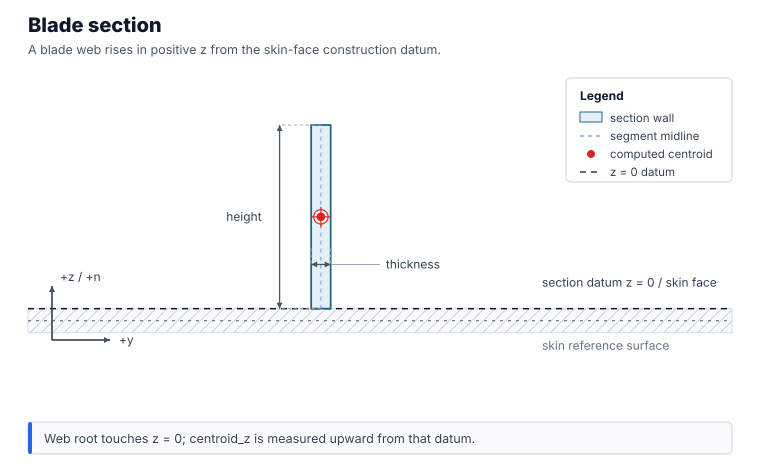

`blade_section` creates one vertical web rooted at `z = 0`.

| Input | Meaning |
| --- | --- |
| `height` | Web midline height measured from the construction datum in `+z`. |
| `thickness` | Web thickness measured in the local `y` direction. |

### Tee Section

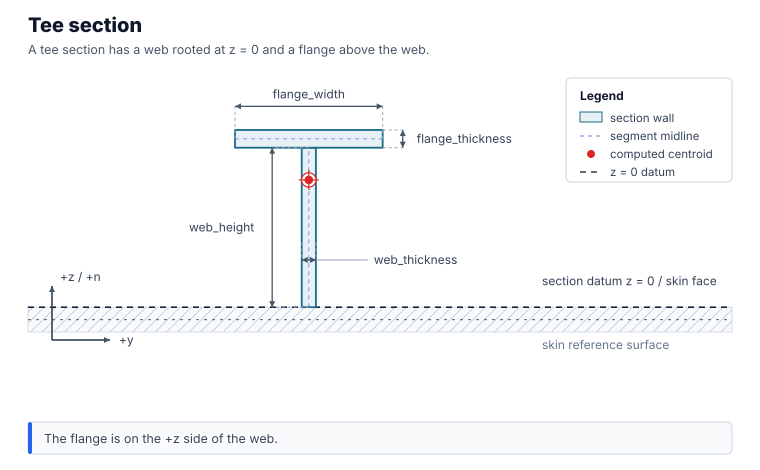

`tee_section` creates a web at `y = 0` with a centered top flange. The flange is
above the web, not touching the skin.

| Input | Meaning |
| --- | --- |
| `web_height` | Web midline height from `z = 0` to the flange midline junction. |
| `web_thickness` | Web thickness measured in the local `y` direction. |
| `flange_width` | Full flange midline width in the local `y` direction. |
| `flange_thickness` | Flange thickness measured in the local `z` direction. |

### Zee Section

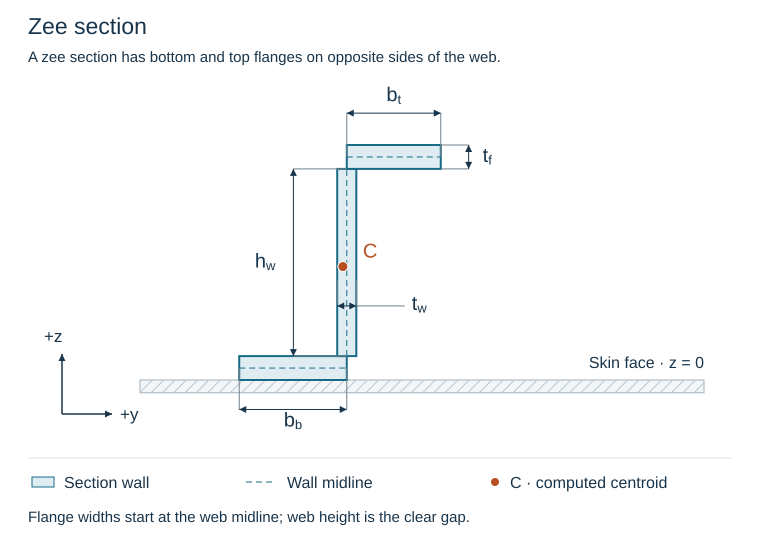

`zee_section` creates a lower flange at the skin-face datum and an upper flange
on the opposite side of the web. The lower flange extends toward `-y`; the upper
flange extends toward `+y`.

| Input | Meaning |
| --- | --- |
| `web_height` | Web midline height between the lower and upper flange regions. |
| `web_thickness` | Web thickness measured in the local `y` direction. |
| `bottom_flange_width` | Lower flange width extending toward `-y`. |
| `top_flange_width` | Upper flange width extending toward `+y`. |
| `flange_thickness` | Thickness used for both flanges, measured in local `z`. |

### Channel Section

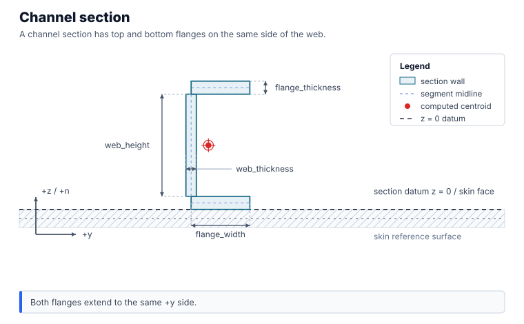

`channel_section` creates lower and upper flanges on the same side of the web.
Both flanges extend toward `+y`; the lower flange sits at the skin-face datum.

| Input | Meaning |
| --- | --- |
| `web_height` | Web midline height between the lower and upper flange regions. |
| `web_thickness` | Web thickness measured in the local `y` direction. |
| `flange_width` | Width of each flange extending toward `+y`. |
| `flange_thickness` | Thickness used for both flanges, measured in local `z`. |

### Hat Section

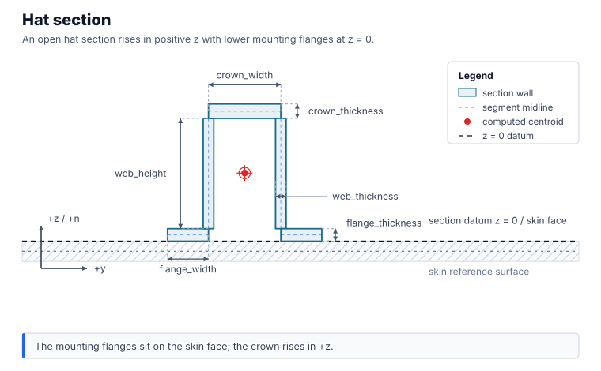

`hat_section` creates an open hat that rises in `+z`. The two lower mounting
flanges sit on the `z = 0` construction datum, so this is the usual external
hat orientation with flanges touching the skin face. It is not flipped downward
into the skin.

| Input | Meaning |
| --- | --- |
| `web_height` | Height of the two side webs from the mounting flanges toward the crown. |
| `web_thickness` | Thickness of each side web, measured in local `y`. |
| `crown_width` | Width of the top crown between the two web centerlines. |
| `crown_thickness` | Crown thickness measured in local `z`. |
| `flange_width` | Width of each lower mounting flange. |
| `flange_thickness` | Thickness of each lower mounting flange, measured in local `z`. |

### Custom Thin-Wall Sections

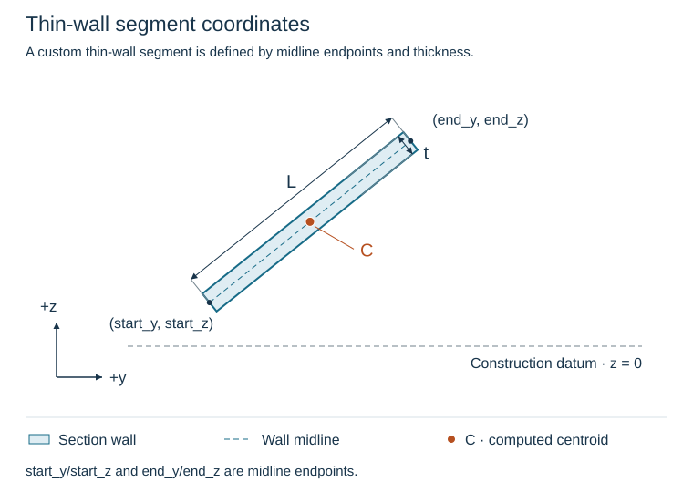

Use `thin_wall_section` with `ThinWallSegment` values for custom open thin-wall
layouts:

```python
from tensyl import ThinWallSegment, thin_wall_section

custom = thin_wall_section(
    material=aluminum,
    segments=(
        ThinWallSegment(-0.5, 0.0, 0.5, 0.0, 0.050, label="flange"),
        ThinWallSegment(0.0, 0.0, 0.0, 0.75, 0.040, label="web"),
    ),
)
```

`start_y`, `start_z`, `end_y`, and `end_z` are segment midline endpoint
coordinates. `thickness` is measured normal to that midline in the same `(y, z)`
section plane.

This is a thin-wall idealization, not an exact solid model of the corner
material. When two segments meet at right angles, the coordinates describe the
meeting of their midlines. That is the same convention a shell or plate model
would usually use for a stiffener wall. If the local corner material, weld
radius, flange/web overlap, or manufacturing detail matters to the section
properties, compute the section externally and pass Tensyl a `BeamSection`
instead.

For US customary examples:

- `EA`, `kGAy`, and `kGAz` use `lbf`;
- `EIy`, `EIz`, and `GJ` use `lbf*in^2`;
- cell dimensions use `in`.

## Named Cells

Use a named constructor when the panel follows one of Tensyl's built-in repeat
patterns. The constructor creates both the member data used for stiffness and
the coordinates needed to draw the cell.

| Constructor | Pattern in plain terms |
| --- | --- |
| `unidirectional_cell` | One family of parallel stiffeners at any angle |
| `orthogrid_cell` | Crossing members along `e1` and `e2` |
| `braced_orthogrid_cell` | An orthogrid with one or two diagonal braces |
| `diamond_cell` | `e1` members with crossing diagonals and no `e2` members |
| `equilateral_isogrid_cell` | Equal members at `0`, `+60`, and `-60` degrees |
| `isosceles_triangle_grid_cell` | `e1` members joined by mirrored diagonals |
| `kagome_cell` | Short `e1` members joined by longer diagonals |
| `hexagonal_grid_cell` | Vertical members joined by mirrored diagonals |
| `star_cell` | A repeating six-point star pattern |
| `sandwich_*_core_cell` | A named grid core between two shifted faces |

Named cells represent the repeating grid, not the joint details. They do not
calculate intersection stress, fastener behavior, local crippling, or weld
effects.

The sandwich cells follow Nemeth in putting the reference surface at the core
midplane, so by default the core members sit on it with zero offset. You can
put the reference somewhere else, such as the bottom face, but then say where
the core is: pass `core_axial_eccentricity`, the signed distance from the
reference surface to the core centroid along `+n`. The face shifts and the core
offset must all point at the same reference surface, or the bending stiffness
will describe a panel you did not build.

The figures below show the source patterns for the less familiar grids. The
same shapes are checked numerically in
[Nemeth Cell Verification](../validation/nemeth-cells.md).

| Constructor family | Treatise topology |
| --- | --- |
| `braced_orthogrid_cell` | 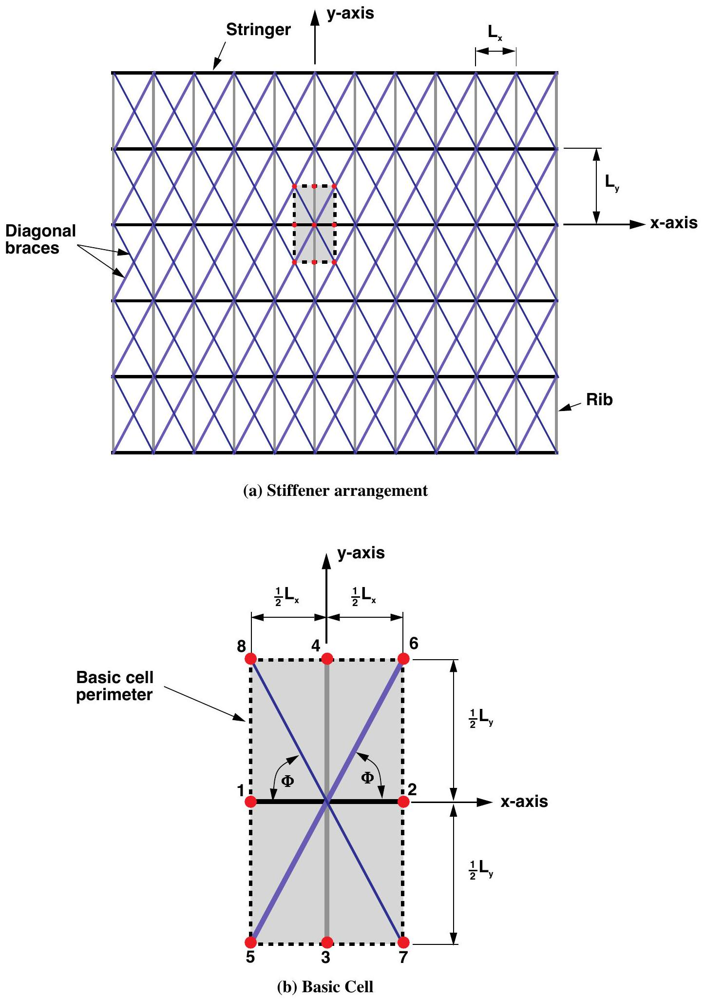 |
| `diamond_cell` | Nemeth figure 15, represented as the figure-14 cell without an `e2` family. |
| `isosceles_triangle_grid_cell` | 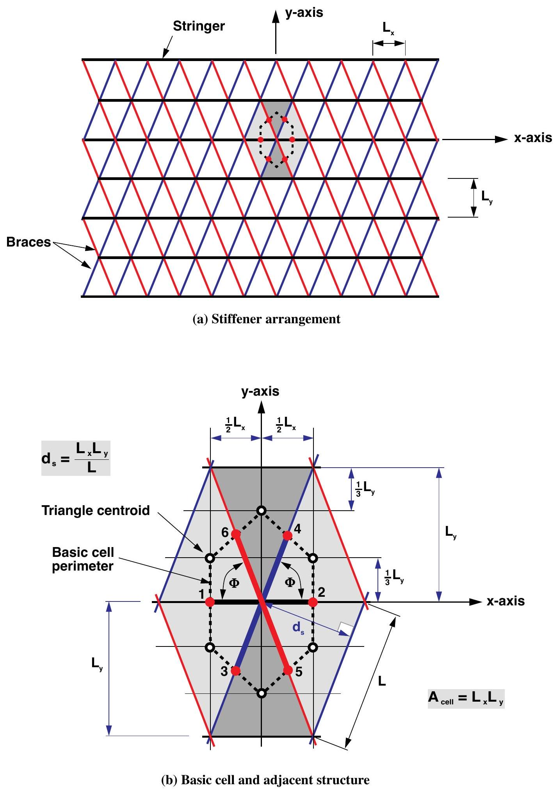 |
| `kagome_cell` | 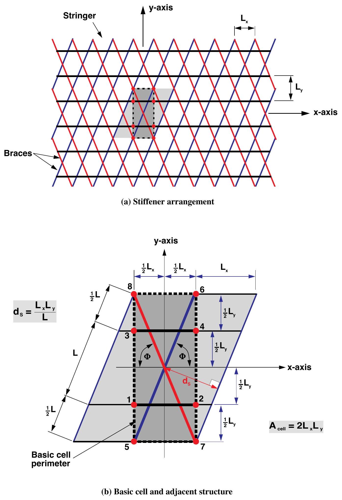 |
| `hexagonal_grid_cell` | 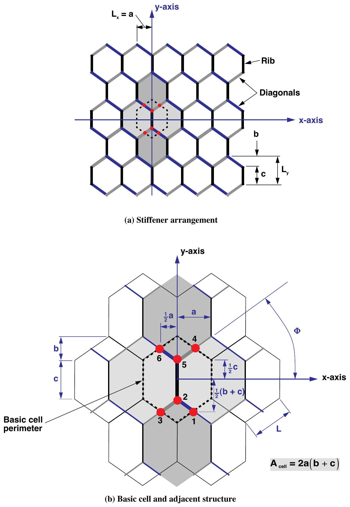 |
| `star_cell` | 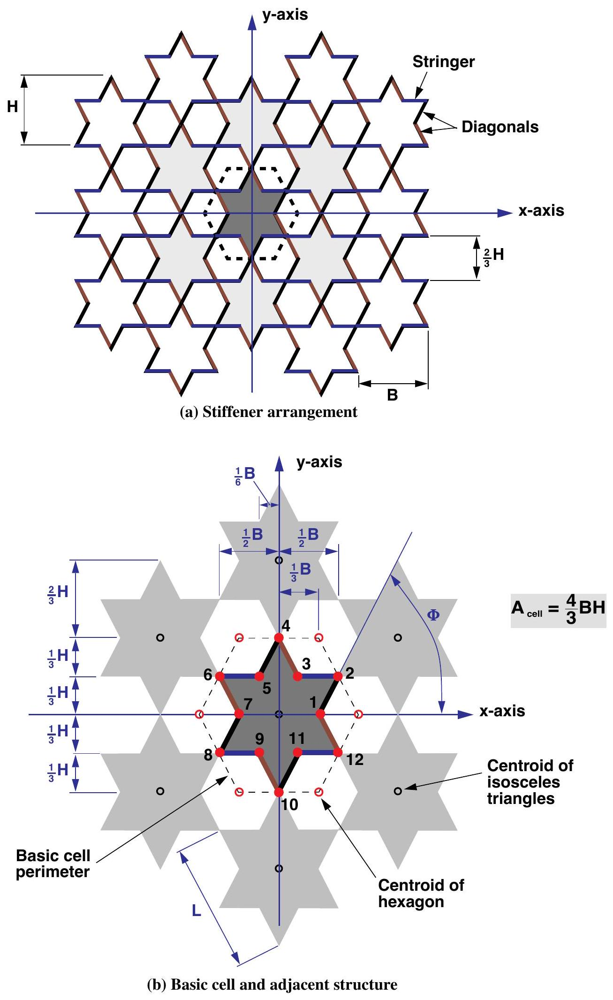 |

*Source for topology definitions: Nemeth, NASA/TP-2011-216882, figures 14-18,
21, and 23 and tables 4-9; full citation in [References](../references.md).*

!!! tip "Read pitch as a repeat-box dimension"
    `e1_pitch` is measured along `e1`, and `e2_pitch` is measured along `e2`.
    An `e1` member is therefore spaced by `e2_pitch`. See the coordinate sketch
    in [Nemeth Cell Verification](../validation/nemeth-cells.md#how-cell-dimensions-are-named).

## Angles and Eccentricity

Angles are measured in the local frame. `0` points along `e1`, `pi/2`
points along `e2`, and positive angles follow the positive rotation convention
about `n`.

Every eccentricity is signed along `+n` from the reference surface. For an
ordinary homogeneous stiffener, set `axial_eccentricity` to the centroid offset
and leave `shear_eccentricity` unset. Tensyl then uses the same value for both.
For an outward-normal cylinder, an external member has a positive offset and an
internal member has a negative offset.

Nemeth allows axial and in-plane shear response to use different effective
offsets for a nonhomogeneous member. Use `shear_eccentricity` only when that
distinction belongs to the section model.

For a geometry-derived stiffener, `centroid_z` is measured from the section's own
construction datum. If that datum is not the wall reference surface, shift the
value before passing it to the cell constructor. A skin mid-surface reference and
an outer-face stiffener datum differ by half the skin thickness. Tensyl cannot
infer that offset for you; set it explicitly.

!!! warning "Check the eccentricity sign"
    Reversing the sign changes the physical `B` coupling block. Tensyl cannot
    infer which side of the reference surface the stiffener occupies. See
    [Frames and Conventions](../theory/conventions.md) for the full sign rule.

## Graph Cells

Use `graph_unit_cell` when a named pattern is not enough. It turns local node
coordinates and beam edges into a repeating cell that the homogenizer can use.

```python
from tensyl import CellEdge, CellNode, CellVector, graph_unit_cell

cell = graph_unit_cell(
    area=48.0,
    skin=skin,
    nodes=(
        CellNode(0.0, 0.0),
        CellNode(6.0, 0.0),
        CellNode(0.0, 8.0),
    ),
    edges=(
        CellEdge(0, 1, section, axial_eccentricity=0.45, family="e1"),
        CellEdge(0, 2, section, axial_eccentricity=0.45, family="e2"),
    ),
    repeat_vectors=(CellVector(6.0, 0.0), CellVector(0.0, 8.0)),
    boundary=(0, 1, 2),
)
```

Node coordinates and area must use the same length unit. With repeat vectors,
`cell.geometry.segments(repeat_a=2, repeat_b=2)` returns ordinary line segments
for Matplotlib, Plotly, a CAD export, or another renderer. A complete plotting
helper is shown in
[Nemeth Cell Verification](../validation/nemeth-cells.md#viewing-any-named-cell).

## Check the Drawn Member Density

Two ribs on opposite repeat boundaries are copies of the same periodic rib.
Counting both at full multiplicity doubles its stiffness. Use the drawing as
an independent accounting check before homogenizing a custom cell:

```python
from tensyl import check_cell_geometry

for family, (drawn, modeled) in check_cell_geometry(cell).items():
    print(f"{family}: drawn {drawn:.6g}, modeled {modeled:.6g}")
```

Both numbers are member length per panel area, so their units are inverse
length. The audit tiles the drawing 3x3, clips it to one repeat parallelogram,
and merges overlapping collinear pieces within each family. A rib on the
upper boundary is represented by its copy on the lower boundary. The modeled
number is `sum(member.multiplicity * member.length) / cell.area` for that
family. Two complete opposite-boundary ribs should therefore each have
multiplicity `0.5`, or be represented by one complete member.

Named patterns, including the half-members in hexagonal cells, are checked in
the test suite. In graph cells, give edges a stable `family`. An omitted member
label falls back to that family, then to `"member"`; explicit edge labels are
preserved. Manually assembled cells need labels matching drawing families or
uniquely labeled drawing edges. Ambiguous mappings and absent geometry raise
`ValueError`, as do drawings that extend outside the surrounding 3x3 repeats.

Unequal densities are returned for review. The function does not change
multiplicity or certify connectivity, section properties, eccentricities, or
member angles. Overlapping segments in different families count separately;
represent one physical family with one name. The optional plotting workflow
above remains useful for inspecting the drawing behind these numbers.

Next: [Frames and Conventions](../theory/conventions.md).
