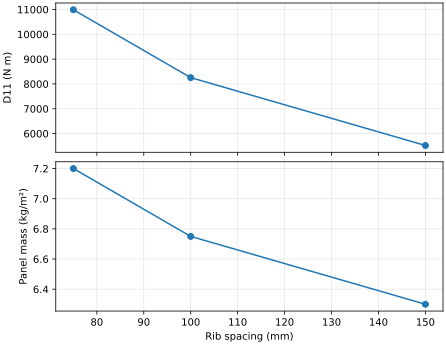

# External Workflows

Use sweeps to compare panel designs, then save the selected inputs and results
for another analysis step. The examples continue with the aluminum skin and
blade from [rib patterns](rib-patterns.md).

## Parameter Sweeps

Vary rib spacing while keeping the skin and rib section fixed:

```python
--8<-- "docs/examples/scripts/panel_workflows.py:sweep"
```

--8<-- "docs/includes/pitch-sweep.md"

Closer ribs increase both bending stiffness and mass per area. The rib bending
increment and mass increment each scale with `1/spacing` in this model.



Each returned dictionary contains the input parameters, 21 named stiffness
coefficients, `areal_mass`, and `warning_codes`. A Cartesian grid visits values
in input order, with the last parameter changing fastest. Feed these rows to
`csv.DictWriter` or a dataframe for further comparisons.

The helper materializes the finite grid and its results. A failed design stops
the sweep with its parameter values attached to the exception. Result-column
names are reserved. An empty grid mapping evaluates the builder once; an empty
parameter axis produces no rows.

## YAML and JSON

Save the computed result and the canonical cell used to reproduce it:

```python
--8<-- "docs/examples/scripts/panel_workflows.py:files"
```

`write_json`/`read_json` and `write_yaml`/`read_yaml` provide the corresponding
file operations. Units describe the numerical values; see
[unit consistency](units-and-consistency.md).

## Traceability

Keep the `HomogenizationResult` to retain stiffness, mass, frame, convention,
validity report, assumptions, and diagnostics. Save the `CanonicalUnitCell`
alongside it when the next workflow needs to repeat homogenization.

## Cell Inputs and Sampled Atlases

A cell artifact stores the resolved skin and member stiffnesses, offsets,
multiplicity, drawing, and metadata. Keep original material and design inputs
in the project model when you also need to regenerate the sections themselves.

An `ABDAtlas` stores a built-in surface, coordinate grids, and sampled local
stiffnesses. Its restored values can be queried independently of the Python
field factory. See the [worked atlas](../examples/sampled-stiffness-atlas.md).
Thermal resultants have a separate artifact type and accompany the mechanical
stiffness when the handoff includes temperature loads.

<span id="schema"></span>
<span id="migration-from-version-2"></span>
Schema version 3 covers stiffnesses, homogenization results, cells, atlases, and
thermal resultants. Readers also accept version 2 stiffness/result files.
The [file-format reference](../api/file-format.md) defines the payload and validation.

## Matrices Copied from Papers

For rounded published tables, use `ABDStiffness.from_published_blocks` with an
explicit relative symmetry tolerance. It averages qualifying off-diagonal
pairs and records the correction per block. The
[API reference](../api/core.md) gives the constructor contract. Establish the
source's units, axes, shear convention, and reference surface before importing.

Next: [Solver handoff](solver-handoff.md).

[Complete workflow script](../examples/scripts/panel_workflows.py).
