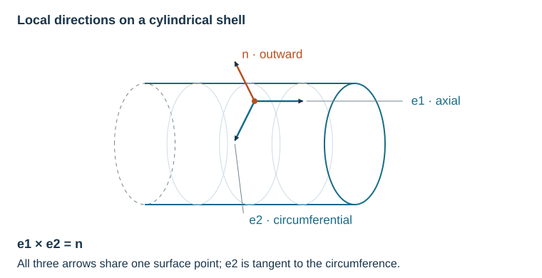

# Geometry and Stiffness Fields

A stiffness field places a panel construction on a plate or shell. The surface
supplies position, local directions, and curvature; the field supplies the
stiffness expressed in those directions.



## Built-In Surfaces

| Surface | Coordinates | Local directions |
| --- | --- | --- |
| `FlatPlate` | Cartesian `(u, v)` | Along the plate axes |
| `Cylinder` | Axial station and azimuth | Axial `e1`, circumferential `e2` |
| `ConicalFrustum` | Axial station and azimuth | Generator `e1`, circumferential `e2` |
| `Sphere`, `SphericalCap` | Polar angle `phi`, azimuth `theta` | Meridional `e1`, circumferential `e2` |
| `Ellipsoid` | Polar angle `phi`, azimuth `theta` | Meridional `e1`, orthonormal tangent completion `e2` |

`surface.point_at(u, v)` returns position, tangent vectors, metric, Jacobian,
curvature, principal curvatures, and a local `Frame2D`. Sphere and ellipsoid
charts use $0<\phi<\pi$; the conical chart uses a finite nonzero radius.

## What Changes When You Choose a Surface

The frame gives the directions in which to read strains, resultants, and rib
angles. The metric and Jacobian give physical distance and area from surface
coordinates. Curvature supplies the scale for the tangent-plane approximation.
Built-in convex surfaces use outward normals and negative nonzero principal
curvatures; `min_radius` gives a positive radius magnitude.

For a triaxial ellipsoid, coordinate tangent directions are generally not
orthogonal. `e2` completes an orthonormal frame with `e1` and `n`. Describe rib
spacing as physical distance in the cell factory; uniform parameter spacing
need not be uniform distance on the surface.

## Constant Stiffness Field

Place the walkthrough's aluminum skin on a cylinder of radius 2 m and length 3 m:

```python
--8<-- "docs/examples/scripts/surface_fields.py:constant"
```

With the default `orientation_rad=0`, the numeric matrix is unchanged and the
returned stiffness carries the surface point's frame. A nonzero `orientation_rad`
sets the angle from surface `e1` to material `e1` about `+n`. For example,
`ConstantStiffnessField(stiffness, orientation_rad=math.pi/2)` turns the material
through 90° and swaps its axial and transverse entries in surface coordinates.
The angle stays fixed relative to the local surface axes as the point moves.

For an anisotropic panel, positive 45° places its material direction 1 along
`(e1 + e2)/sqrt(2)`. This is equivalent to expressing its matrix with
`stiffness.rotate(-orientation_rad)` before binding the local frame.

## Surface Recipes

Use a constant field for a uniform panel construction. Use a cell factory when
pitch, material, section, or orientation changes with position. The
[varying-cylinder example](../examples/sampled-stiffness-atlas.md#pointwise-homogenized-field)
widens stringer spacing from 100 to 120 mm along the barrel, reducing its local
axial stiffness.

## Stiffness Atlas

An `ABDAtlas` samples a field on a rectangular coordinate grid and bilinearly
interpolates stiffness entries between samples. It binds the result to the
query point's local frame. Sample densely enough to resolve the design variation;
place a new model boundary at a discontinuous change in construction.
See the [executable atlas example](../examples/sampled-stiffness-atlas.md).

## Choosing a Response Length

A constant field preserves the source stiffness's attached report. To assess a
new curved application, call `validity_report_for_stiffness` with the new
surface context. A `HomogenizedStiffnessField` can create that context for every
sample through `validity_context_factory`.

Choose response length from the bending, buckling, or load-redistribution mode
being studied. The [modeling guide](../theory/validity.md#choose-the-response-scales)
explains that choice and the available ratios.
