# Rib Patterns and Repeat Cells

Choose a named pattern when the drawing has a regular grid, independent families
when each rib direction has its own spacing, or a graph when you want to specify
the nodes and edges yourself. All three feed the same energy calculation.

The examples share a 2 mm aluminum skin and a 25 mm blade:

```python
--8<-- "docs/examples/scripts/panel_workflows.py:setup"
```

## Named Cells

| Constructor | Pattern in plain terms |
| --- | --- |
| `unidirectional_cell` | One family of parallel stiffeners at any angle |
| `orthogrid_cell` | Crossing members along `e1` and `e2` |
| `braced_orthogrid_cell` | An orthogrid with one or two diagonal braces |
| `diamond_cell` | `e1` members with crossing diagonals and no `e2` members |
| `equilateral_isogrid_cell` | Equal members at `0`, `+60`, and `-60` degrees |
| `isosceles_triangle_grid_cell` | `e1` members joined by mirrored diagonals |
| `kagome_cell` | Short `e1` members joined by longer diagonals |
| `hexagonal_grid_cell` | Vertical members joined by mirrored diagonals |
| `regular_hexagonal_grid_cell` | A regular hexagonal grid defined by one side length |
| `star_cell` | A repeating six-point star pattern |
| `equilateral_star_cell` | An equilateral star grid defined by one side length |
| `sandwich_*_core_cell` | An orthogrid, hexagonal, or star core between two faces |


The [orthogrid walkthrough](../getting-started/first-homogenized-cell.md) shows the
pitch convention: `e1_pitch` measures the repeat along `e1`; members running in
`e1` are separated by `e2_pitch`. The
[Nemeth pattern catalogue](../validation/nemeth-cells.md#available-patterns)
shows the other topologies and their source definitions.

For sandwich builders, use the core midplane as the common reference by default.
Face offsets locate the faces relative to it. If another reference is chosen,
set `core_axial_eccentricity` and both face offsets consistently.

## Pattern Gallery

Each drawing below comes from an actual cell built by the
[executable gallery](../examples/scripts/pattern_gallery.py), using the aluminum
skin and blade dimensions above. Blue lines mark rib centerlines. The dashed
orange parallelogram spans the two repeat vectors returned by the builder;
its area is the area used in homogenization. The right view enlarges that same
cell, with neighboring ribs shown in pale blue. Both axes use the same length
scale within each view. Click any drawing to open it at full size.

The figures list dimensions in millimeters for reading; the script supplies
meters to the constructors. The [Nemeth catalogue](../validation/nemeth-cells.md#available-patterns)
links these topologies to their source drawings and numerical checks.

### Parallel Ribs and Orthogrids

The parallel-rib builder uses a 1 m reference length along the ribs. Its repeat
area is that length times the perpendicular spacing. The orthogrid has two
independent pitches; its highlighted cell is centered on a rib intersection.

[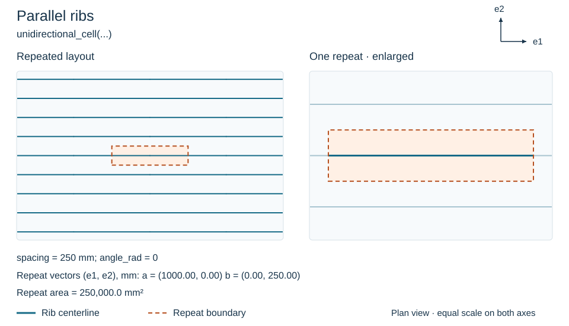](../assets/patterns/unidirectional.svg "Open full-size pattern")

[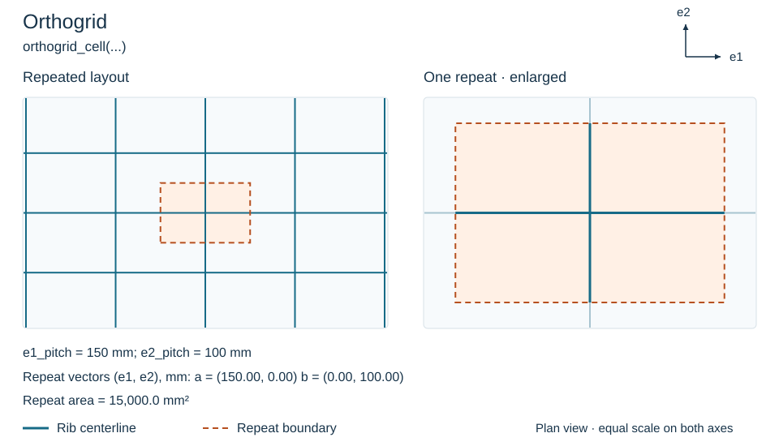](../assets/patterns/orthogrid.svg "Open full-size pattern")

### Braced Orthogrids

Double bracing places both diagonals in every bay. Single bracing alternates
the diagonal direction between neighboring bays, so its repeat spans two
pitches in each direction.

[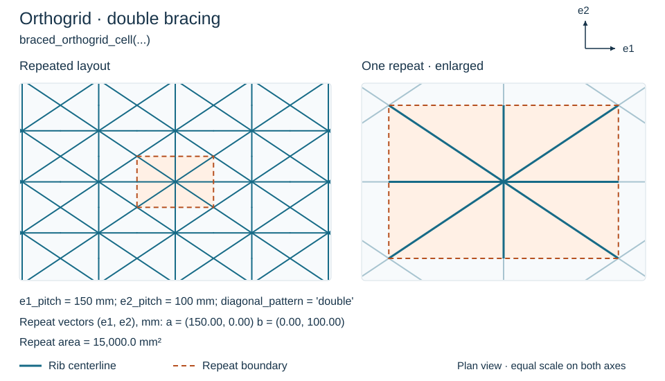](../assets/patterns/braced-double.svg "Open full-size pattern")

[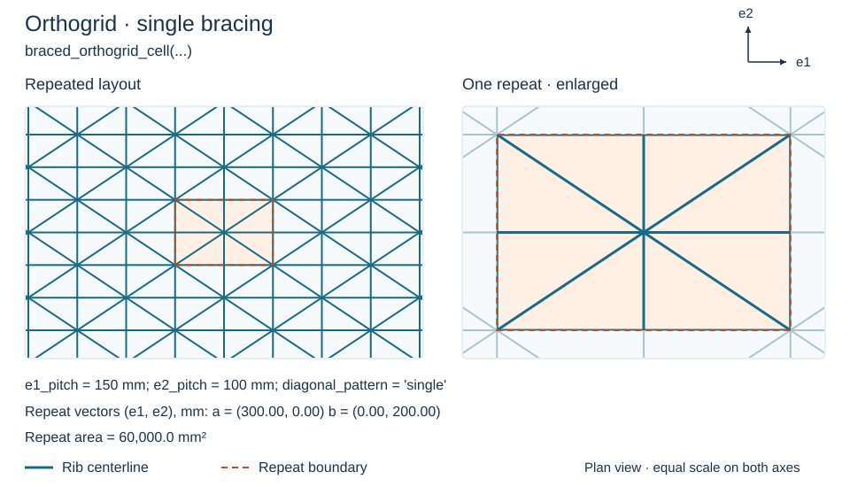](../assets/patterns/braced-single.svg "Open full-size pattern")

### Diamond and Triangular Grids

The diamond grid joins horizontal ribs with crossing diagonals. The isosceles
grid joins horizontal ribs with a staggered triangular pattern. For an
equilateral isogrid, supply one side length: the three directions are then
`0`, `+60`, and `-60` degrees. Its repeat parallelogram contains the area of
two elementary triangles.

[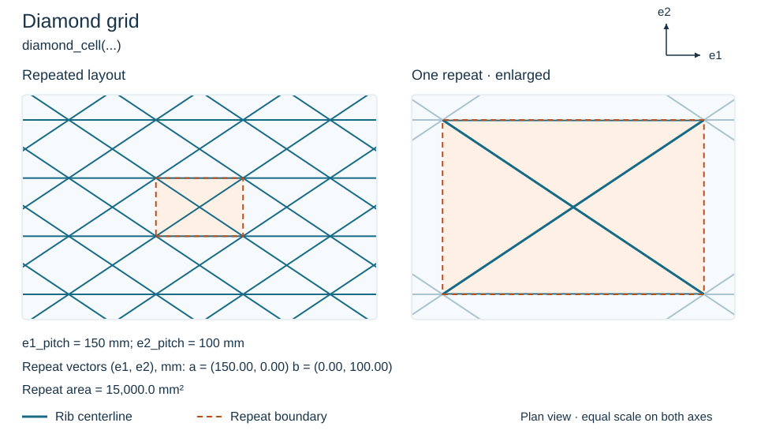](../assets/patterns/diamond.svg "Open full-size pattern")

[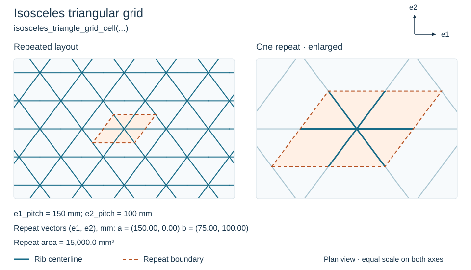](../assets/patterns/isosceles.svg "Open full-size pattern")

[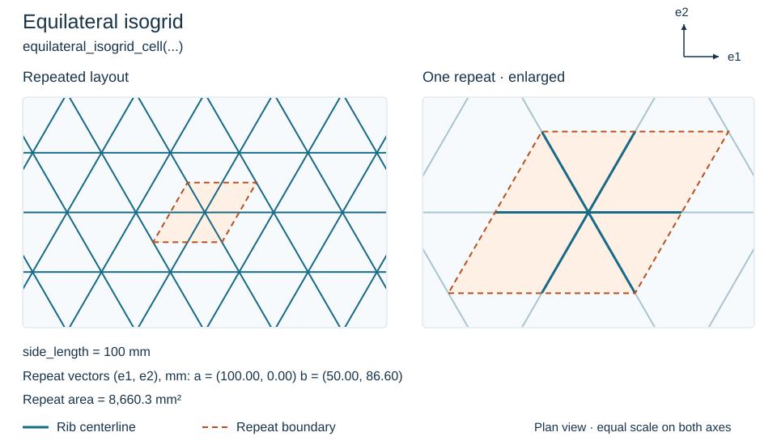](../assets/patterns/isogrid.svg "Open full-size pattern")

### Kagome and Hexagonal Grids

The Kagome builder follows Nemeth's figure 18: horizontal members cross two
diagonal families, with the horizontal rows offset from diagonal intersections.
The general hexagonal
builder lets you set the horizontal construction dimension, diagonal rise,
and vertical member length separately. The regular variant sets their
proportions from one side length.

[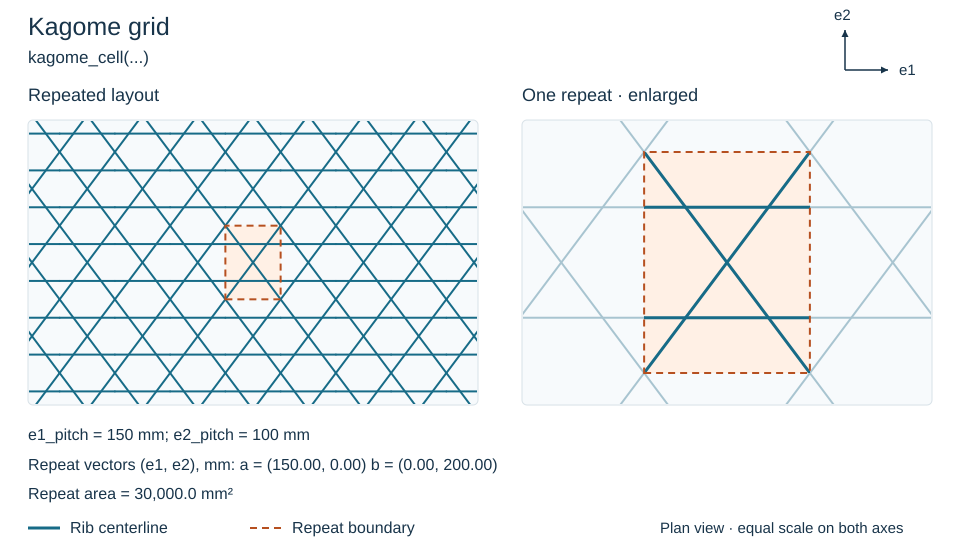](../assets/patterns/kagome.svg "Open full-size pattern")

[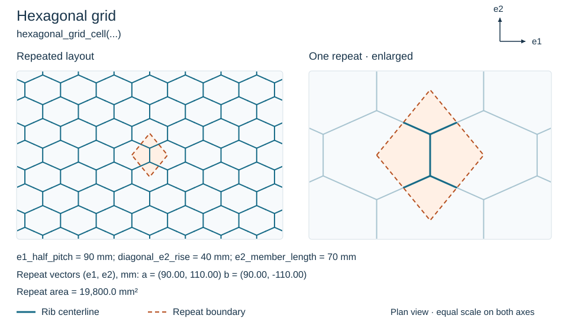](../assets/patterns/hexagonal.svg "Open full-size pattern")

[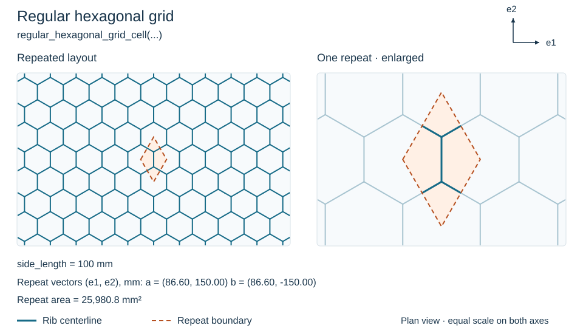](../assets/patterns/regular-hexagonal.svg "Open full-size pattern")

### Star Grids

The star builders form repeated six-point openings. The general builder uses
the star construction dimensions `e1_pitch` and `e2_pitch`; its vertical
translation is `4 * e2_pitch / 3`. The equilateral variant derives those
dimensions from one side length.

[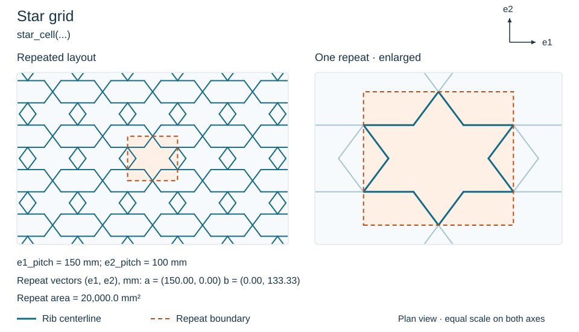](../assets/patterns/star.svg "Open full-size pattern")

[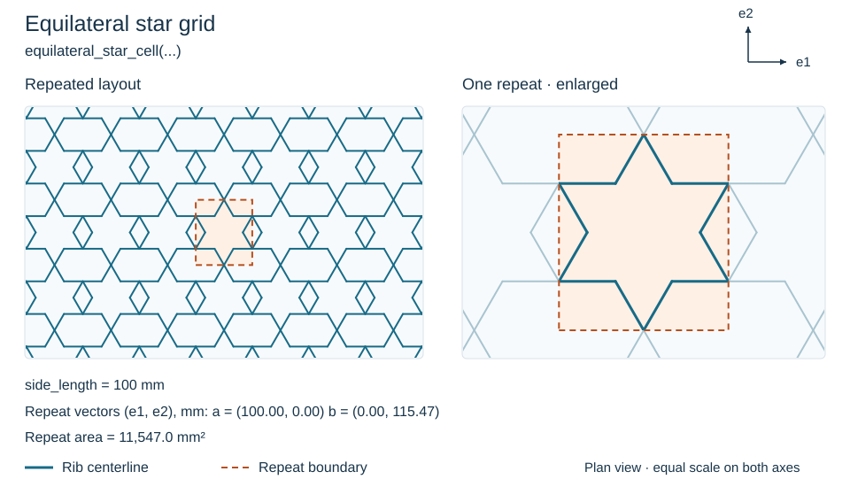](../assets/patterns/equilateral-star.svg "Open full-size pattern")

### Sandwich Cores

These plan views show the ribs between two face sheets. The gallery builds
each core with 25 mm high, 2 mm thick blades and two 2 mm aluminum faces.
With the reference at the core midplane, the face midplanes lie at
$z=\pm13.5$ mm. The corresponding face-to-reference shifts are `+0.0135` m
for the bottom face and `-0.0135` m for the top face; the core eccentricity is
zero. Each constructor combines the shifted face stiffnesses with the core
members shown below.

[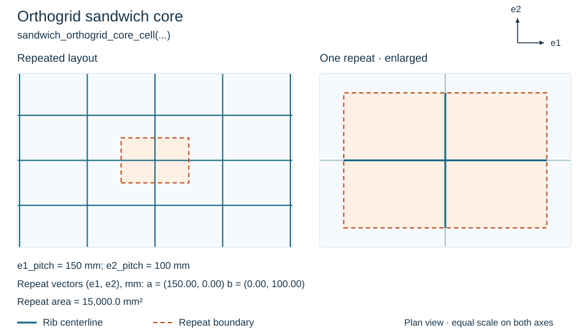](../assets/patterns/sandwich-orthogrid.svg "Open full-size pattern")

[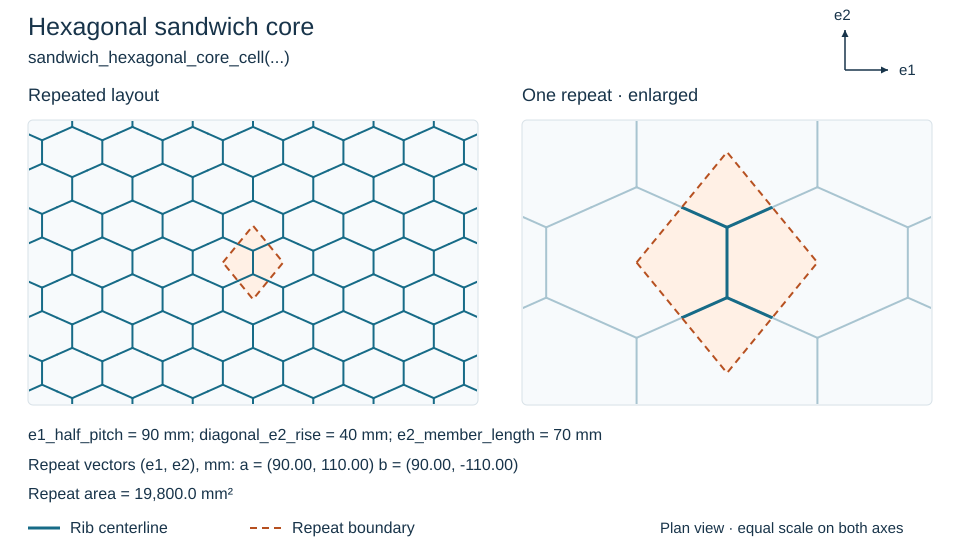](../assets/patterns/sandwich-hexagonal.svg "Open full-size pattern")

[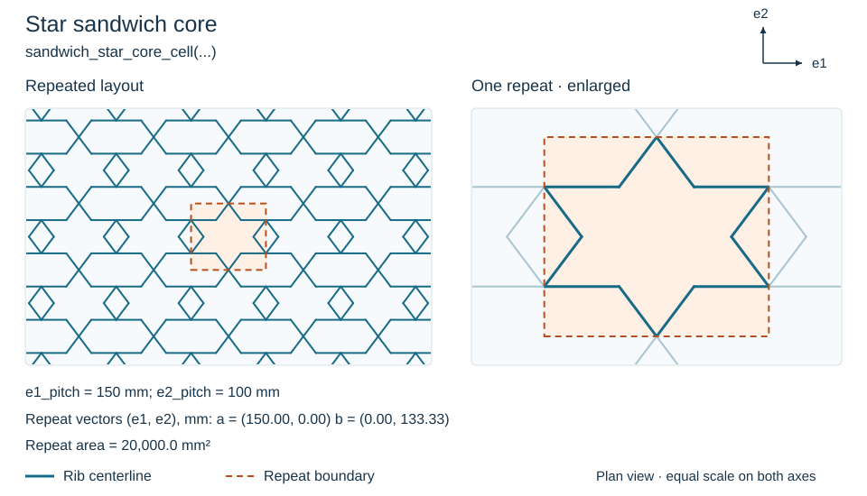](../assets/patterns/sandwich-star.svg "Open full-size pattern")

## Independent Families

Specify the perpendicular spacing of each family directly:

```python
--8<-- "docs/examples/scripts/panel_workflows.py:families"
```

Each family contributes `multiplicity / spacing` of rib length per area.
Families can have unrelated spacings and angles; they need no common repeat box.
The result has the same stiffness as the walkthrough's orthogrid.

Angles are radians from local `e1` toward `e2` about `+n`. Eccentricities are
signed distances along `+n` from the panel reference surface. The default shear
eccentricity equals the axial eccentricity; set it separately for a section with
distinct effective axial and shear offsets.

## Graph Cells

Define a repeat rectangle with one complete rib on each of its lower and left
edges. Repeating the rectangle supplies the adjacent copies:

```python
--8<-- "docs/examples/scripts/panel_workflows.py:graph"
```

The graph builder derives member lengths and angles from the node coordinates.
This example produces the same repeated layout as the orthogrid shown above.
Area has units m² and the repeat vectors have units m. For plotting,
`custom_cell.geometry.segments(repeat_a=2, repeat_b=2)` returns line segments;
the [plotting example](../validation/nemeth-cells.md#viewing-any-named-cell)
shows how to draw them.

## Check the Drawn Member Density

`density_audit` contains `(drawn, modeled)` length per area for each family:
10 m⁻¹ for `e1`, and 6.66667 m⁻¹ for `e2` in this example. The modeled value is
$\sum_m\mu_m L_m/A_\mathrm{cell}$.

The audit tiles the drawing 3×3, clips one repeat parallelogram, and merges
overlapping collinear segments within each family. Opposite-boundary ribs are
periodic copies: represent them as two half-members or one full member. Use a
stable family name for each physical family, so drawn and modeled quantities
refer to the same ribs. Unequal densities are returned for inspection.

Next: [Read the homogenization result](homogenization.md).

[Complete patterns and workflows script](../examples/scripts/panel_workflows.py).
