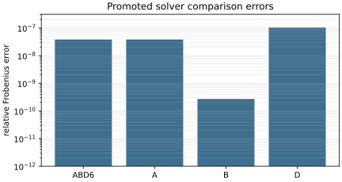
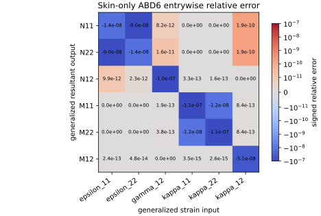

# Validation Gallery

The gallery is the public evidence index for committed validation artifacts. It
is generated from manifests and metrics under `validation/artifacts/committed/`,
so target artifacts and solver-backed comparisons stay visibly separate.

Regenerate the summary and plot with:

```bash
uv run python validation/scripts/build_gallery_summary.py
uv run python validation/scripts/build_skin_only_abd6_comparison.py
```

The generated machine-readable summary is
`validation/artifacts/committed/gallery_summary.json`.

## Current Solver Comparison Plot



Only one solver-backed comparison is promoted today: the skin-only local ABD
`ABD6` extraction. The stiffened local ABD, flat-panel, and barrel rows below
are target oracles or planned comparison scaffolds until explicit solver metrics
are promoted.

## Skin-Only ABD6 Matrix Comparison



The detailed comparison table is committed as
`validation/artifacts/committed/local_abd/skin_only/abd6_comparison_table.csv`,
with a JSON twin at
`validation/artifacts/committed/local_abd/skin_only/abd6_comparison_table.json`.
It lists all 36 target and extracted `ABD6` entries in Tensyl order, their
absolute errors, and signed entrywise relative errors using
`max(abs(target), 1.0)` as the denominator. The global promoted comparison
metric remains the Frobenius norm, not the largest painted square in the figure.

| Entry | Target | CalculiX extraction | Absolute error | Entry relative error |
| --- | ---: | ---: | ---: | ---: |
| `A11` | 951632.813 | 951632.800 | -1.34e-2 | -1.41e-8 |
| `A12` | 314038.828 | 314038.800 | -2.84e-2 | -9.05e-8 |
| `A66` | 318796.992 | 318796.960 | -3.25e-2 | -1.02e-7 |
| `D11` | 507.537500 | 507.537444 | -5.63e-5 | -1.11e-7 |
| `D22` | 507.537500 | 507.537444 | -5.63e-5 | -1.11e-7 |
| `D66` | 170.025063 | 170.025054 | -8.71e-6 | -5.12e-8 |

## Summary Matrix

| Case | Phase | Artifact role | Solver evidence | Primary metric |
| --- | --- | --- | --- | --- |
| `local_abd_skin_only` | Phase 1 local ABD | `calculix_extraction` | Promoted CalculiX `ABD6` comparison. | `ABD6_relative_frobenius_error = 3.79e-8` |
| `local_abd_unidirectional` | Phase 1 local ABD | `tensyl_target` | Planned; no promoted stiffened FE comparison. | `symmetric_C8 = true` |
| `local_abd_orthogrid_zero_eccentricity` | Phase 1 local ABD | `tensyl_target` | Planned; no promoted stiffened FE comparison. | `symmetric_C8 = true` |
| `local_abd_orthogrid_eccentric` | Phase 1 local ABD | `tensyl_target` | Planned; no promoted stiffened FE comparison. | `symmetric_C8 = true` |
| `local_abd_isogrid_equilateral` | Phase 1 local ABD | `tensyl_target` | Planned; no promoted stiffened FE comparison. | `symmetric_C8 = true` |
| `flat_panel_orthogrid_axial_smeared` | Phase 2 flat panel | `tensyl_smeared_panel_target` | Target only; explicit FE panel comparison planned. | `smeared_equilibrium_relative_residual = 3.41e-16` |
| `barrel_orthogrid_axial_smeared` | Phase 3 barrel | `tensyl_smeared_barrel_target` | Target only; explicit FE barrel comparison planned. | `p_over_R = 0.0667`, `p_over_L_response = 0.0833` |

## What Counts As A Result

The table uses three evidence levels:

- **Promoted solver comparison**: a solver-backed artifact with comparison
  metrics and provenance. Currently this exists only for the skin-only `ABD6`
  extraction.
- **Target oracle**: a Tensyl-generated target with metrics and manifest, ready
  for future solver comparison. These are real reference values, not agreement
  evidence.
- **Planned comparison**: a case whose solver model, parser, or promotion path is
  documented but not yet promoted.

When future FE cases are promoted, they should add generated metrics and plots
here rather than replacing the target rows. A good gallery can say "not yet"
without coughing.
