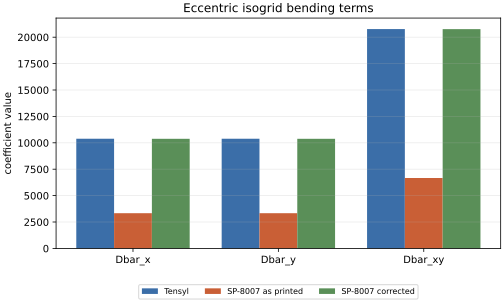
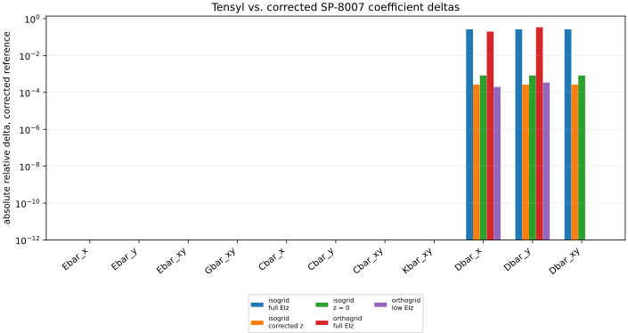
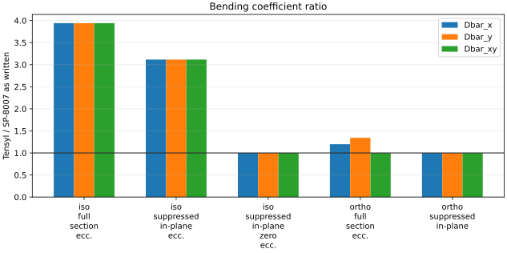
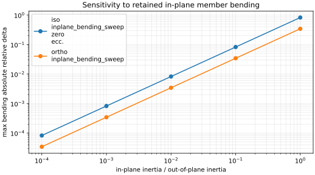
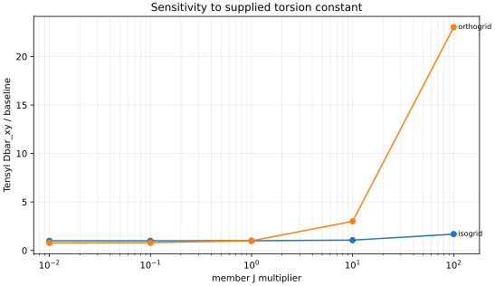

# SP-8007 Reconciliation

This page compares Tensyl's tangent-plane stiffnesses with the elastic-constant
formulas in NASA SP-8007 Section 4.1.2.6. It is not a calibration exercise.
SP-8007 is a published design reference, but it is not an oracle for Tensyl, and
Tensyl is not an oracle for SP-8007. The useful question is narrower and harder:
when the numbers diverge, which physics did each model keep or throw away?

## Read This First

The isogrid equations in SP-8007 Eqs. 97-98 appear to contain a real printed
formula error. They do not show explicit parallel-axis `EA z^2` bending terms,
even though the same section includes eccentric extensional-bending coupling
terms and the earlier general stiffener formulas include the corresponding
parallel-axis contribution.

For the eccentric isogrid cases, this audit therefore reports two SP-8007
references:

- SP-8007 as printed;
- SP-8007 with the missing isogrid parallel-axis terms restored.

The correction used here is

$$
\bar{D}_{x,\mathrm{corr}}
=
\bar{D}_{x,\mathrm{printed}}
+
\frac{3\sqrt{3}}{4}\frac{EA}{a}z^2,
$$

$$
\bar{D}_{y,\mathrm{corr}}
=
\bar{D}_{y,\mathrm{printed}}
+
\frac{3\sqrt{3}}{4}\frac{EA}{a}z^2,
$$

and

$$
\bar{D}_{xy,\mathrm{corr}}
=
\bar{D}_{xy,\mathrm{printed}}
+
\frac{3\sqrt{3}}{2}\frac{EA}{a}z^2.
$$

With that correction, the large eccentric-isogrid discrepancy goes away in the
case where in-plane member bending has been suppressed. That matters because
typos are not very interesting. The remaining differences are the ones that
tell us something about the model.

## What Was Compared

The audit computes three sets of coefficients for each case. First it evaluates
the SP-8007 equations as printed: ring-and-stringer orthogrids use Eqs. 82-91,
and equilateral isogrids use Eqs. 92-98. Second it applies the isogrid correction
above where it is needed. Third it computes a Tensyl ABD stiffness and extracts
the same SP-8007-style barred coefficients from that matrix.

For a cylinder, Tensyl's local `e1` direction is axial and `e2` is
circumferential, so the mapping is:

| SP-8007 coefficient | Tensyl source |
| --- | --- |
| `Ebar_x` | `A[0, 0]` |
| `Ebar_y` | `A[1, 1]` |
| `Ebar_xy` | `A[0, 1]` |
| `Gbar_xy` | `A[2, 2]` |
| `Dbar_x` | `D[0, 0]` |
| `Dbar_y` | `D[1, 1]` |
| `Dbar_xy` | `2*D[0, 1] + 4*D[2, 2]` |
| `Cbar_x` | `B[0, 0]` |
| `Cbar_y` | `B[1, 1]` |
| `Cbar_xy` | `B[0, 1]` |
| `Kbar_xy` | `B[2, 2]` |

The last bending row is the easy place to make a bad comparison. SP-8007's
`\bar{D}_{xy}` is a modified twisting stiffness, not Tensyl's `D66` entry by
itself. With Tensyl's engineering twist convention, the coefficient is

$$
\bar{D}_{xy} = 2D_{12} + 4D_{66}.
$$

## Correcting the Isogrid Typo

The plot below isolates the eccentric isogrid case with the member in-plane
bending inertia driven very small. SP-8007 as printed misses the eccentric axial
energy in the bending terms. Once the `EA z^2` terms are restored, Tensyl and
the corrected hand formula agree to the residual left by the intentionally tiny
`EIz`.



This is the right way to use SP-8007 in the rest of the audit: not as an oracle,
but as a source that can still contain a mistake. After this correction, the
main isogrid discrepancy is no longer evidence of a Tensyl problem.

## Orthogrid Model Difference

The orthogrid mismatch is different. It does not disappear because of the
isogrid correction, and it is not a convention problem. Tensyl is retaining a
real member stiffness that the SP-8007 ring/stringer formulas in Eqs. 89-91 do
not expose.

Tensyl's member strain map gives each rib or stringer a finite in-plane bending
stiffness contribution when the equivalent wall bends across that member. For an
axis-aligned orthogrid, the SP-8007 printed formulas include same-family
out-of-plane bending and eccentric axial bending:

$$
\bar{D}_x
\leftarrow
\frac{(EI_y)_s}{b_s}
+
\frac{(EA)_s z_s^2}{b_s},
$$

$$
\bar{D}_y
\leftarrow
\frac{(EI_y)_r}{b_r}
+
\frac{(EA)_r z_r^2}{b_r}.
$$

Tensyl also includes the cross-family in-plane bending terms:

$$
\Delta \bar{D}_x = \frac{(EI_z)_r}{b_r},
$$

$$
\Delta \bar{D}_y = \frac{(EI_z)_s}{b_s}.
$$

In plain terms, a rib is not invisible when the wall bends axially across it,
and a stringer is not invisible when the wall bends circumferentially across it.
If that member has appreciable in-plane bending stiffness, Tensyl stores that
energy. The SP-8007 orthogrid hand equations used here do not.

The coefficient-level comparison below uses the corrected SP-8007 reference.
The membrane terms, coupling terms, and modified twisting term agree to roundoff
for the orthogrid cases when the inputs are normalized the same way. The bending
terms remain different until the cross-family `EIz` contribution is made small.



The bending ratios show the same point more directly.



And the sweep below makes the mechanism explicit. As the member in-plane inertia
is reduced relative to its out-of-plane inertia, the orthogrid bending mismatch
collapses.



## Engineering Impact

The orthogrid mismatch lives in the bending block of the equivalent wall law. It
does not change the basic axis-aligned membrane `A` terms in these cases, and it
does not mean every SP-8007-style handoff is wrong. It means that an SP-8007
orthogrid reduction can underpredict bending stiffness when the stiffener has
meaningful in-plane section inertia.

The impact is largest for grids where the stiffener is not a slender blade. Wide
caps, flanges, tees, channels, z-stiffeners, hat sections, box-like stiffeners,
and closed or nearly closed sections can all have enough `EIz` for the
cross-family term to matter. Dense grids and thin skins make the effect easier
to see because the member stiffness is spread over a smaller wall area and the
skin contributes less of the total bending stiffness.

The downstream risk is usually a buckling or load-redistribution risk. A
classical orthotropic-cylinder calculation that receives the lower SP-8007
bending terms may predict different buckling loads, different preferred modes,
or different margins than a calculation that receives Tensyl's fuller ABD
stiffness. That does not automatically make Tensyl conservative or
nonconservative in every case; the sign of the margin change depends on the
load, shell geometry, mode shape, and knockdown workflow. It does mean engineers
should not collapse a stiffener-rich wall into SP-8007 barred constants without
checking how much `EIz` has been thrown away.

This is the strongest conclusion from the audit: for these orthogrid cases,
Tensyl is capturing more first-order section physics than the compact SP-8007
ring/stringer formulas show.

## Which `J` Should Be Used?

The torsion constant is not a universal number. `BeamSection.GJ` should be the
torsional stiffness of the member idealization you mean to put into the
homogenized wall.

Use an open-section St Venant `J` when the stiffener behaves like a freely
warping open member. That is the assumption behind Tensyl's simple thin-wall
section helper:

$$
J_{\mathrm{sv}} \approx \sum_i \frac{l_i t_i^3}{3}.
$$

This is appropriate for first estimates of blades, angles, tees, channels, and
other open members when warping is not strongly restrained. It is not a magic
property of the drawing.

Use a closed-cell torsional stiffness when the actual modeled member has a
closed shear-flow path. A closed hat bonded to a skin, a tube, or a box can have
a torsional stiffness many times larger than the open-section estimate. But the
closure has to belong to the member model. If the skin is already present as a
separate plate in the ABD calculation, adding a closed-cell `J` that also uses
that same skin can double-count skin shear stiffness.

Use a restrained-warping torsional stiffness when the boundary conditions,
attachments, or neighboring structure prevent the section from warping freely.
That value is usually a section-analysis or finite-element result, not the free
St Venant constant and not the closed-cell Bredt constant by itself.

So the answer is not that open-section `J`, closed-cell `J`, or restrained
warping `J` is always more correct. The correct value is the torsional stiffness
of the section and boundary condition represented by the homogenized member. If
that boundary condition is uncertain, bracket it. The plot below shows how much
the modified twisting stiffness moves when the supplied member `J` is swept over
large factors.



## Guidance

Use the SP-8007-style coefficients when a downstream classical
orthotropic-cylinder calculation expects exactly that data shape. In that
workflow, export the coefficients with the mapping above, keep the assumptions
with the artifact, and do not pass `D66` as `\bar{D}_{xy}`.

Keep the full Tensyl ABD stiffness when the wall has meaningful off-axis terms,
strong membrane-bending coupling, or section properties that do not match the
simplified SP-8007 assumptions. Reducing a richer wall law to a short list of
barred constants can be the right handoff, but it is a reduction. It should be
treated as one.

Be especially careful with these inputs:

- `EIz`: Tensyl retains cross-family in-plane member bending, while the SP-8007
  orthogrid expressions used here do not expose the same term.
- Eccentricity: SP-8007 isogrid Eqs. 97-98 should be corrected for explicit
  `EA z^2` bending terms before drawing physics conclusions.
- `J`: open-section St Venant torsion, closed-cell torsion, and restrained
  warping can differ by large factors; choose the value that matches the member
  model and boundary condition.

## Artifacts

The committed evidence lives under
`validation/artifacts/committed/sp8007_reconciliation/`:

- `comparison_table.json` and `comparison_table.csv` contain the coefficient
  rows, including the printed and corrected SP-8007 references;
- `summary.json` records the worst corrected-reference term by case and the
  interpretation notes;
- `inplane_bending_sweep.json` records the `EIz` sweep;
- `torsion_sweep.json` records the `J` sensitivity sweep;
- `manifest.json` records provenance for the run.

Regenerate the report data with:

```bash
uv run python validation/scripts/build_sp8007_reconciliation.py
```

The public mechanics references for this page are NASA SP-8007 and Nemeth's
equivalent-plate treatise, both listed in [References](../references.md).
