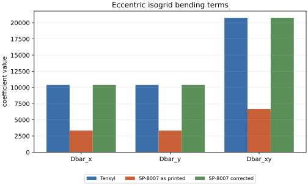
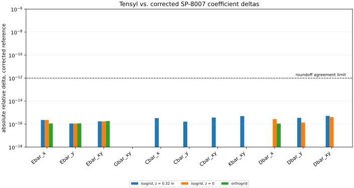
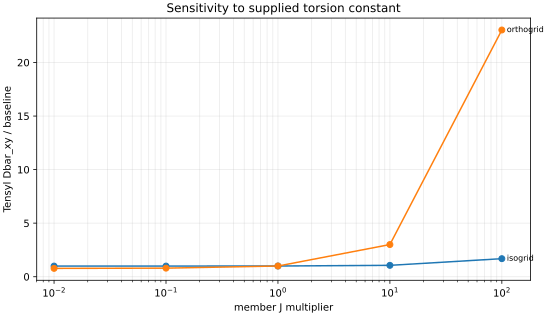

# SP-8007 Reconciliation

This page compares Tensyl's tangent-plane stiffnesses with the elastic-constant
formulas in NASA SP-8007 Section 4.1.2.6. It is not a calibration exercise.
SP-8007 is a published design reference, but it is not an oracle for Tensyl, and
Tensyl is not an oracle for SP-8007. The useful question is narrower and harder:
when the numbers diverge, which physics did each model keep or throw away?

The SP-8007 source used for this audit is Mark Hilburger's
*Buckling of Thin-Walled Circular Cylinders*, NASA/SP-8007-2020/REV 2:
<https://ntrs.nasa.gov/citations/20205011530>.

## Read This First

The isogrid equations in SP-8007 Eqs. 97-98 omit the explicit parallel-axis
`EA z^2` bending terms. The same section includes eccentric
extensional-bending coupling terms, and the earlier general stiffener formulas
include the corresponding parallel-axis contribution. For a centroidal
stiffener offset from the reference surface, the `EA z^2` bending energy is part
of the stiffness. Tensyl includes that term.

For the eccentric isogrid cases, this audit therefore reports two SP-8007
references:

- SP-8007 as printed;
- SP-8007 with the missing isogrid parallel-axis terms restored.

The correction used here is

$$
\bar{D}_{x,\mathrm{corr}}
=
\bar{D}_{x,\mathrm{printed}}
+
\frac{3\sqrt{3}}{4}\frac{EA}{a}z^2,
$$

$$
\bar{D}_{y,\mathrm{corr}}
=
\bar{D}_{y,\mathrm{printed}}
+
\frac{3\sqrt{3}}{4}\frac{EA}{a}z^2,
$$

and

$$
\bar{D}_{xy,\mathrm{corr}}
=
\bar{D}_{xy,\mathrm{printed}}
+
\frac{3\sqrt{3}}{2}\frac{EA}{a}z^2.
$$

With that correction, every coefficient in every case agrees with Tensyl to
floating-point roundoff. The eccentric-isogrid discrepancy is a printed-equation
omission, not a difference in physics.

## What Was Compared

The audit computes three sets of coefficients for each case. First it evaluates
the SP-8007 equations as printed: ring-and-stringer orthogrids use Eqs. 82-91,
and equilateral isogrids use Eqs. 92-98. Second it applies the isogrid correction
above where it is needed. Third it computes Tensyl's default energy-homogenized
ABD stiffness and extracts the same SP-8007-style barred coefficients from that
matrix.

For a cylinder, Tensyl's local `e1` direction is axial and `e2` is
circumferential, so the mapping is:

| SP-8007 coefficient | Tensyl source |
| --- | --- |
| `Ebar_x` | `A[0, 0]` |
| `Ebar_y` | `A[1, 1]` |
| `Ebar_xy` | `A[0, 1]` |
| `Gbar_xy` | `A[2, 2]` |
| `Dbar_x` | `D[0, 0]` |
| `Dbar_y` | `D[1, 1]` |
| `Dbar_xy` | `2*D[0, 1] + 4*D[2, 2]` |
| `Cbar_x` | `B[0, 0]` |
| `Cbar_y` | `B[1, 1]` |
| `Cbar_xy` | `B[0, 1]` |
| `Kbar_xy` | `B[2, 2]` |

The last bending row is the easy place to make a bad comparison. SP-8007's
`\bar{D}_{xy}` is a modified twisting stiffness, not Tensyl's `D66` entry by
itself. With Tensyl's engineering twist convention, the coefficient is

$$
\bar{D}_{xy} = 2D_{12} + 4D_{66}.
$$

The named cases in the plots are:

| Plot label | Model | What it checks |
| --- | --- | --- |
| `orthogrid` | Ring-and-stringer orthogrid with eccentric members, `z = 0.32 in` | SP-8007 Eqs. 82-91 term by term, including coupling and modified twisting. |
| `isogrid, z = 0` | Equilateral isogrid with centered members | The limit where the printed and corrected Eqs. 97-98 are the same. |
| `isogrid, z = 0.32 in` | Equilateral isogrid with eccentric members | Isolates the missing `EA z^2` terms in SP-8007 Eqs. 97-98. |

All three cases use the same material, skin thickness, stiffener area,
out-of-plane inertia, torsion constant, and local spacing or pitch. The values
are `E = 10.6e6 psi`, `nu = 0.33`, `t = 0.080 in`, `A = 0.030 in^2`,
`Iy = 1.20e-3 in^4`, `J = 2.50e-4 in^4`, orthogrid spacings `bs = 6 in` and
`br = 8 in`, and isogrid pitch `a = 6 in`.

## Correcting the Isogrid Typo

The plot below isolates the eccentric isogrid case. SP-8007 as printed omits
the eccentric axial energy in the bending terms. Once the `EA z^2` terms are
restored, Tensyl and the corrected hand formula agree to roundoff.



The bars compare the same physical case three ways. The blue bar is Tensyl. The
orange bar is SP-8007 exactly as printed. The green bar is SP-8007 with the
`EA z^2` correction restored. The green and blue bars lie together because the
missing printed term is the source of the large orange-bar gap.

After this correction, the main isogrid discrepancy is not a Tensyl problem. It
is the missing printed `EA z^2` term in SP-8007 Eqs. 97-98.

## Agreement Across Every Coefficient

With the printed isogrid omission corrected, the two calculations are the same
calculation written two ways. The plot below shows the largest difference for
each coefficient in each case, measured against the corrected SP-8007 value.
Every bar sits near `1e-16`, the size of double-precision roundoff, and well
below the dashed `1e-12` line the report uses as its agreement limit. A missing
bar means the two values matched exactly.



That is a stronger result than it looks. SP-8007's orthogrid equations are
written family by family with scalar `EA/b`, `EI/b`, and `GJ/b` terms, while
Tensyl rotates each member's strain map into the panel frame and assembles an
`8 x 8` energy matrix. The isogrid bending coefficients show it most clearly:
SP-8007's $3\sqrt{3}\,EI/(4a) + \sqrt{3}\,GJ/(4a)$ falls straight out of the
member transforms at `0` and `+/-60` degrees. Agreement to roundoff means the
member kinematics, the rotations, the density of each family, and the barred
coefficient mapping are all doing what the hand formulas do.

It is still not proof that either model is right about a real panel. Both
calculations share the same first-approximation member kinematics, so they
share the same blind spots: local skin buckling between stiffeners, joint
flexibility, and anything the smeared-stiffener idea cannot see. Finite-element
and test evidence answer those questions; this comparison does not.

## Why Earlier Reports Disagreed

Reports published with Tensyl 0.3.1 and earlier turned on an optional
`include_in_plane_bending` extension for this study and showed an orthogrid
bending gap proportional to `EIz`. That extension has been removed. It let a
member's in-plane bending stiffness `EIz` resist plate curvature across the
member, but a member's axis stays straight in the panel plane under uniform
wall strain and curvature, so beam theory gives that term no energy. Nemeth's
first approximation, $\chi_Z = 0$, says the same thing. The gap the old report
attributed to "cross-family in-plane bending" was stiffness that the physical
panel does not have.

A wide flange does resist bending across its width, but through its own plate
bending stiffness, roughly `E w t^3 / 12` per unit length, not through
`EIz = E t w^3 / 12`. For a flange that is ten times wider than it is thick,
the two differ by a factor of one hundred. If that flange stiffness matters for
your panel, model it as part of the skin or with a detailed section model
rather than through the member `EIz`.

## Which `J` Should Be Used?

The torsion constant is not a universal number. `BeamSection.GJ` should be the
torsional stiffness of the member idealization you mean to put into the
equivalent panel.

Use an open-section St Venant `J` when the stiffener behaves like a freely
warping open member. That is the assumption behind Tensyl's simple thin-wall
section helper:

$$
J_{\mathrm{sv}} \approx \sum_i \frac{l_i t_i^3}{3}.
$$

This is the correct input for blades, angles, tees, channels, and other open
members when warping is not strongly restrained.

Use a closed-cell torsional stiffness when the actual modeled member has a
closed shear-flow path. A closed hat bonded to a skin, a tube, or a box can have
a torsional stiffness many times larger than the open-section estimate. But the
closure has to belong to the member model. If the skin is already present as a
separate plate in the ABD calculation, adding a closed-cell `J` that also uses
that same skin can double-count skin shear stiffness.

Use a restrained-warping torsional stiffness when the boundary conditions,
attachments, or neighboring structure prevent the section from warping freely.
That value is usually a section-analysis or finite-element result, not the free
St Venant constant and not the closed-cell Bredt constant by itself.

Open-section `J`, closed-cell `J`, and restrained-warping `J` represent
different member models. The correct value is the torsional stiffness of the
section and boundary condition represented by the homogenized member. If that
boundary condition is uncertain, bracket it. The plot below shows how much the
modified twisting stiffness moves when the supplied member `J` is swept over
large factors.



This plot does not choose a torsion model. It shows the consequence of the `J`
value supplied to the member. The orthogrid line moves strongly because its
modified twisting stiffness receives direct stringer and rib `GJ` terms. The
isogrid line moves less in this synthetic case because the same coefficient also
contains larger bending and corrected eccentric-axial contributions. A closed
cell or restrained-warping model can move a real design along this axis by large
factors.

## Guidance

Use the SP-8007-style coefficients when a downstream classical
orthotropic-cylinder calculation expects exactly that data shape. In that
workflow, export the coefficients with the mapping above, keep the assumptions
with the artifact, and do not pass `D66` as `\bar{D}_{xy}`.

Keep the full Tensyl ABD stiffness when the panel has meaningful off-axis terms,
strong membrane-bending coupling, or section properties that do not match the
simplified SP-8007 assumptions. Reducing the full ABD stiffness to a short list
of barred constants can be the right handoff, but it is still a reduction.

Be especially careful with these inputs:

- Eccentricity: SP-8007 isogrid Eqs. 97-98 should be corrected for explicit
  `EA z^2` bending terms before drawing physics conclusions.
- `J`: open-section St Venant torsion, closed-cell torsion, and restrained
  warping can differ by large factors; choose the value that matches the member
  model and boundary condition.

## Artifacts

The committed evidence lives under
`validation/artifacts/committed/sp8007_reconciliation/`:

- `comparison_table.json` and `comparison_table.csv` contain the coefficient
  rows, including the printed and corrected SP-8007 references;
- `summary.json` records the worst corrected-reference term by case and the
  interpretation notes;
- `torsion_sweep.json` records the `J` sensitivity sweep;
- `manifest.json` records provenance for the run.

Regenerate the report data with:

```bash
uv run python validation/scripts/build_sp8007_reconciliation.py
```

The public mechanics references for this page are NASA SP-8007 and Nemeth's
equivalent-plate treatise, both listed in [References](../references.md).
